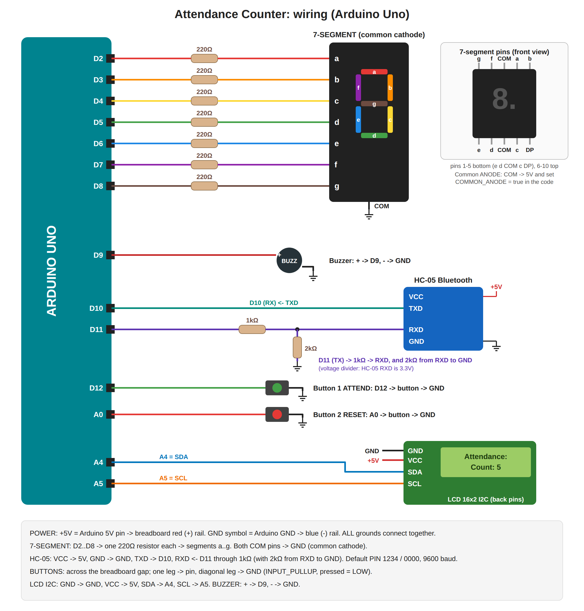

# Exam Problem 1: Attendance Counter with Bluetooth Reporting (Arduino Uno)



## What it does
| Action | Result |
|--------|--------|
| Press **Button 1 (ATTEND)** | Count + 1, buzzer beeps, 7-segment and LCD update |
| Press **Button 2 (RESET)** | Count goes back to 0 |
| Phone sends **`C`** (or `?`) through the HC-05 | Arduino replies `Attendance count: N` |
| Holding a button down / bouncing contacts | Counts only **once** per press (debounced) |

The 7-segment shows **0–9**. After 9 it shows the last digit (12 → `2`). The LCD always shows the full count.

## Components
- Arduino Uno + USB data cable
- HC-05 Bluetooth module
- 2 push buttons
- 1-digit 7-segment display (common cathode) + **7 × 220 Ω** resistors
- LCD 16x2 with I2C backpack (4 pins)
- Buzzer
- 1 kΩ + 2 kΩ resistors (HC-05 voltage divider). If you have no 2 kΩ, use two 1 kΩ in series.
- Breadboard, jumper wires

## Wiring table

| Component pin | Arduino Uno |
|---------------|-------------|
| **Power:** breadboard + rail | 5V |
| **Power:** breadboard − rail | GND |
| 7-seg **a** (through 220 Ω) | D2 |
| 7-seg **b** (through 220 Ω) | D3 |
| 7-seg **c** (through 220 Ω) | D4 |
| 7-seg **d** (through 220 Ω) | D5 |
| 7-seg **e** (through 220 Ω) | D6 |
| 7-seg **f** (through 220 Ω) | D7 |
| 7-seg **g** (through 220 Ω) | D8 |
| 7-seg **COM** (either middle pin) | GND (common cathode) / 5V (common anode) |
| Buzzer **+** | D9 |
| Buzzer **−** | GND |
| HC-05 **VCC** | 5V |
| HC-05 **GND** | GND |
| HC-05 **TXD** | D10 |
| HC-05 **RXD** | D11 → **1 kΩ** → RXD, and **2 kΩ** from RXD to GND |
| Button 1 (ATTEND): one leg | D12; the diagonal leg → GND |
| Button 2 (RESET): one leg | A0; the diagonal leg → GND |
| LCD **GND** | GND |
| LCD **VCC** | 5V |
| LCD **SDA** | A4 |
| LCD **SCL** | A5 |

### 7-segment pinout (front view, decimal point at bottom right)
```
   top row:     g   f  COM  a   b        (pins 10 9 8 7 6)
                ┌──────────────┐
                │      a       │
                │   f     b    │
                │      g       │
                │   e     c    │
                │      d    .DP│
                └──────────────┘
   bottom row:  e   d  COM  c  DP        (pins 1 2 3 4 5)
```
**How to tell common cathode from anode:** connect COM → GND and touch any segment pin through 220 Ω to 5V.
If it lights, it's **common cathode** (as in the code). If not, try COM → 5V and the segment → GND. If that lights,
it's **common anode**: wire COM to 5V and set `COMMON_ANODE = true` in the code.

## Build order (do it in this order)
1. **Power rails:** Uno 5V → red + rail, Uno GND → blue − rail.
2. **7-segment:** place it across the middle gap. Add the 7 resistors from D2–D8 to a–g, and COM → GND.
3. **Buttons:** place them across the gap. Button 1 to D12 + GND, Button 2 to A0 + GND.
4. **Buzzer:** + to D9, − to GND.
5. **LCD:** 4 wires (GND, VCC, SDA→A4, SCL→A5).
6. **HC-05:** VCC, GND, TXD→D10, RXD via the divider from D11.
7. Double-check, then plug in USB.

## Upload
1. Arduino IDE → **Tools → Manage Libraries** → install **LiquidCrystal I2C** (Frank de Brabander).
2. Open `attendance_counter.ino`.
3. **Tools → Board → Arduino Uno**, **Port → COMx**, then **Upload**.
   The HC-05 can stay connected, because it uses D10/D11 and not the USB pins D0/D1.
4. **Serial Monitor** at **9600**. Type `C` and press Enter: it prints the count (a test without the phone).

## Test with the phone (Android)
1. Install **Serial Bluetooth Terminal** (by Kai Morich) from the Play Store.
2. Phone **Settings → Bluetooth** → pair **HC-05**, PIN **1234** (or `0000`).
   The HC-05 LED blinks fast when not connected, and slowly or twice every 2 s once connected.
3. In the app: **☰ → Devices → Bluetooth Classic → HC-05** → tap **Connect** (plug icon at the top).
4. Type **`C`** and press send. You get back `Attendance count: 3`.
5. Press Button 1 a few times, send `C` again, and the number goes up. Press Button 2, send `C`, and you get `0`.

## Explaining the code to the instructor
- `wasPressed()` = **debounce + edge detect**: it only returns `true` once, when the button changes from released to pressed and stays steady for 50 ms. That's the "valid press".
- `count++` → `showCount()` updates the **7-segment** (`DIGITS[]` table: which segments a–g light for 0–9) and the **LCD**.
- `tone(BUZZER, 2000, 150)` = 150 ms beep on every valid registration.
- `SoftwareSerial bt(10, 11)` = serial port for the HC-05 at 9600 baud. When the phone sends `C`, `sendCount()` replies with the count ("when requested").
- Button 2 sets `count = 0` and refreshes the displays.

## Troubleshooting
| Problem | Fix |
|---------|-----|
| 7-segment shows wrong or garbled digits | A segment wire is in the wrong place. Check a–g against the pinout (D2=a … D8=g). |
| 7-segment fully dark | Wrong type: try `COMMON_ANODE = true` with COM → 5V |
| LCD backlight on but no text | Turn the blue contrast screw. Try `0x3F` instead of `0x27`. |
| `LiquidCrystal_I2C.h: No such file` | Install the LiquidCrystal I2C library |
| Count jumps by 2+ on one press | Bad button contact. Raise `50` to `80` in `wasPressed()`. |
| Count goes up by itself | The button isn't wired to GND, or it's in the wrong orientation. Use diagonal legs. |
| Phone gets nothing | Pairing PIN 1234. TXD→D10 and RXD←D11 (not swapped). App connected (HC-05 LED blinking slowly). |
| Phone shows garbage | HC-05 baud isn't 9600. Try `bt.begin(38400);`. |
