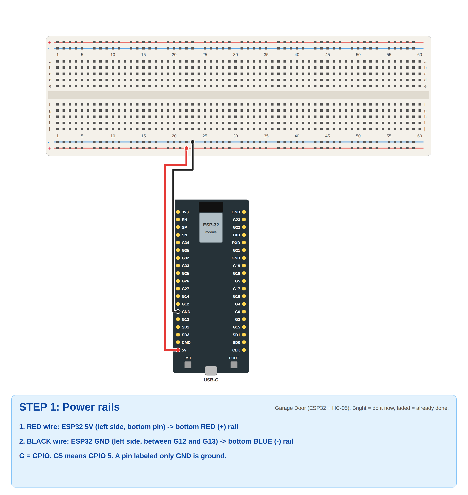
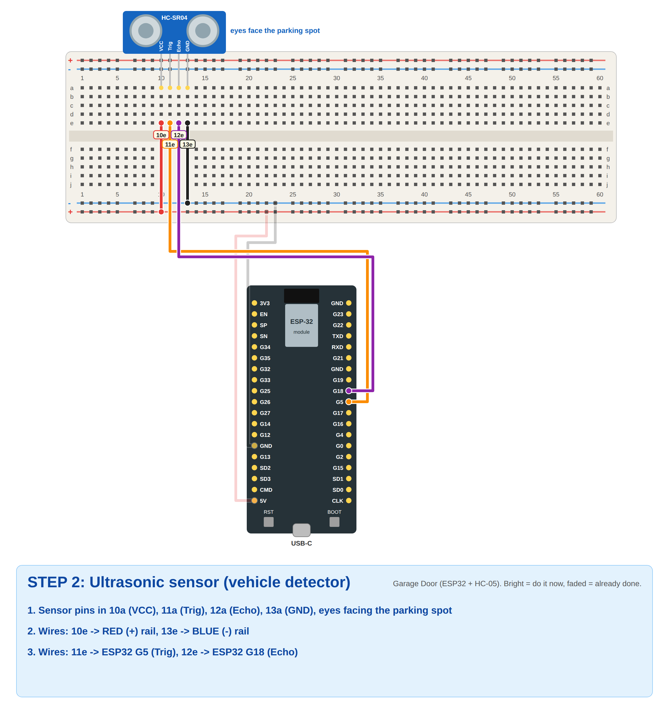
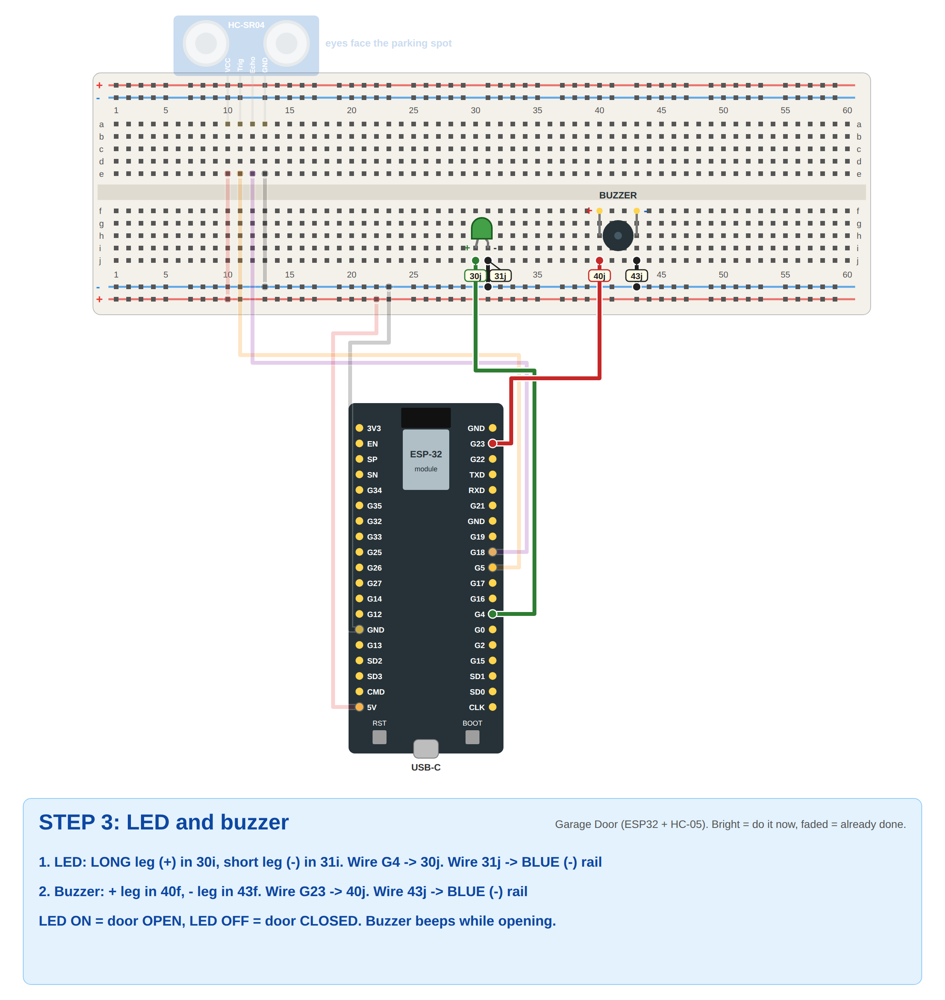
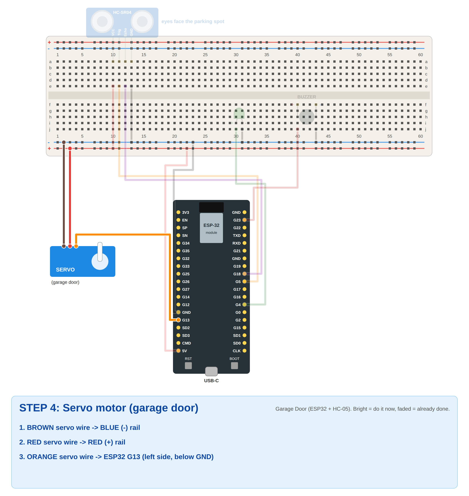
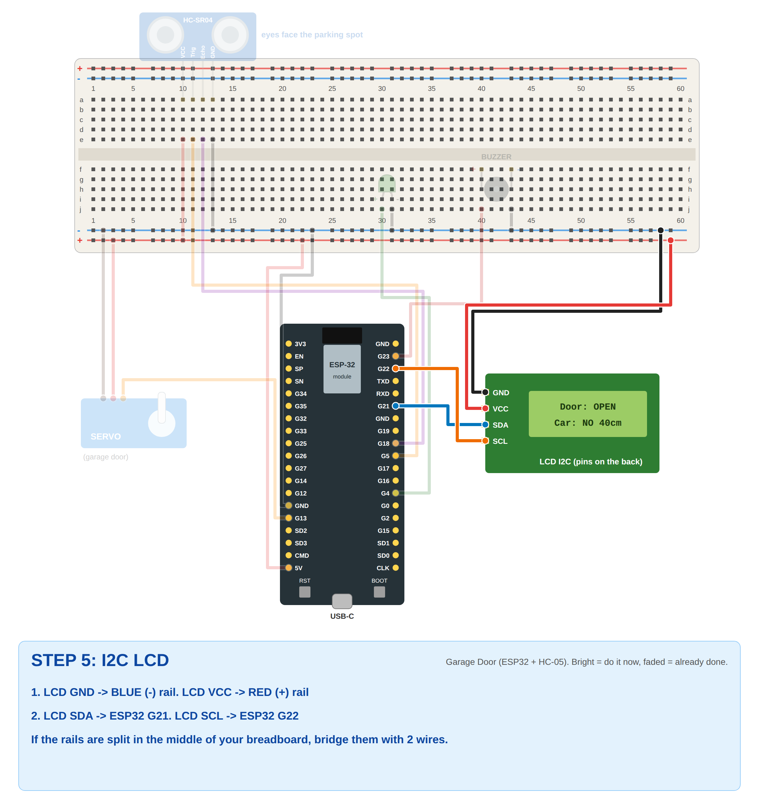
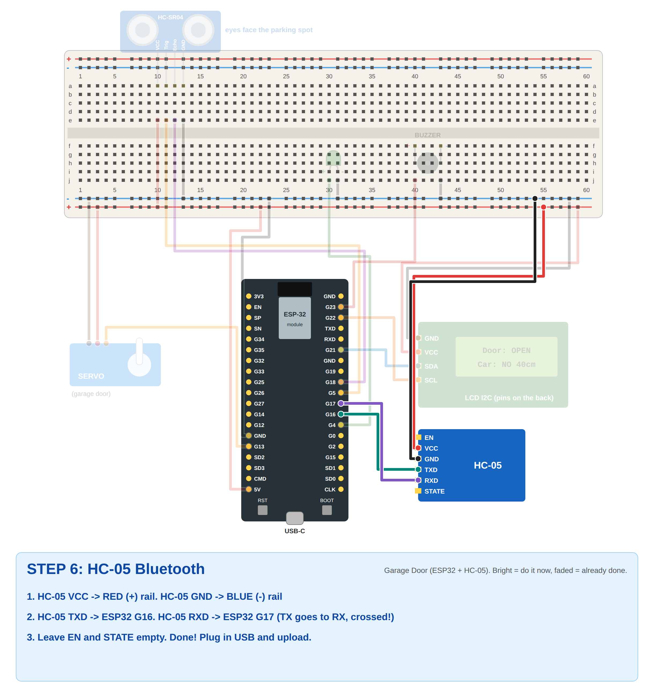
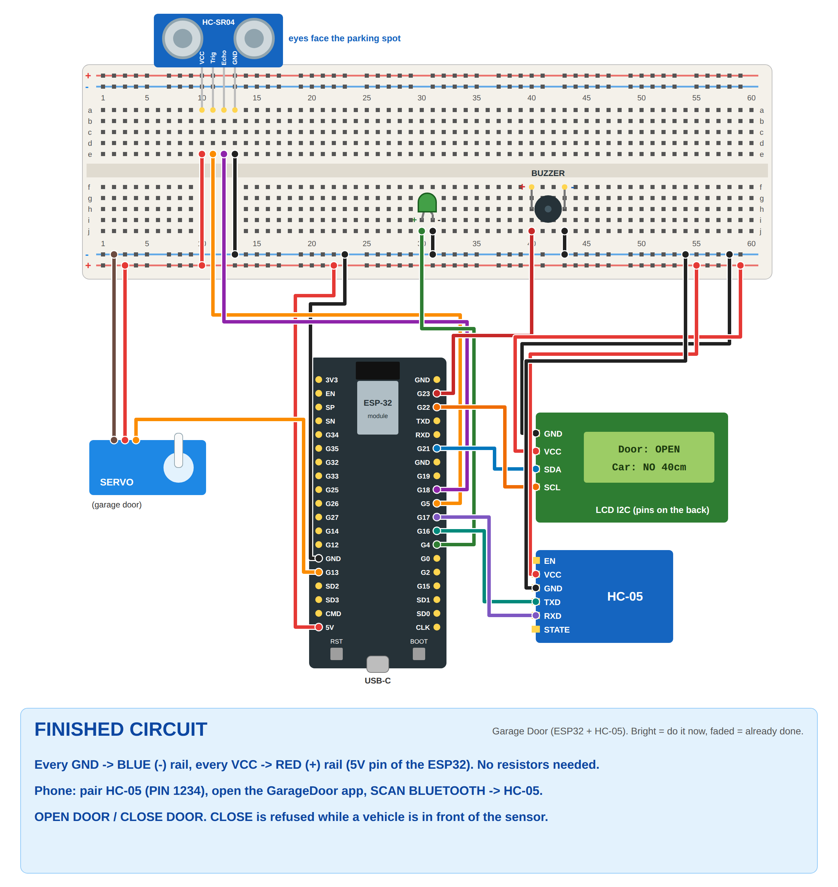

# Problem 14: Mobile-Controlled Garage Door (ESP32 + HC-05)

✅ **Verified:** the code compiles for *ESP32 Dev Module* (ESP32 core 3.3.12, no warnings), and the door logic passes
**22 simulated tests** (`sim_test/run.sh`): open, close, close refused with a vehicle, door reopens if a car appears
while closing, buzzer only while opening, LED and LCD text.

## What it does
| Phone sends | Vehicle in front of sensor? | Result |
|-------------|-----------------------------|--------|
| **OPEN** | doesn't matter | Door (servo) opens slowly 0° → 90°, **buzzer beeps while opening**, LED **ON**, LCD `Door: OPENING...` → `Door: OPEN` |
| **CLOSE** | **no** | Door closes 90° → 0°, LED **OFF**, LCD `Door: CLOSED` |
| **CLOSE** | **yes** (closer than 15 cm) | **Refused.** Door stays open, LCD `BLOCKED: Car in!`, phone shows "Cannot close: vehicle detected!" |
| *(car appears while closing)* | yes | Door **stops and opens again** (safety) |

How each requirement is met:
- **OPEN/CLOSE through the HC-05:** HC-05 on Serial2 (G16/G17), 9600 baud. Commands `OPEN` / `CLOSE`.
- **Servo = garage door:** 0° closed, 90° open, moving 1° every 20 ms.
- **Ultrasonic detects a vehicle:** distance under `VEHICLE_CM` (15 cm) = vehicle present.
- **No closing with a vehicle in the area:** CLOSE is refused, and closing stops and reopens if a car appears.
- **LED shows OPEN/CLOSED:** ON = open (or moving), OFF = closed.
- **LCD shows door status:** line 1 `Door: ...`, line 2 `Car: YES/NO` + distance.
- **Buzzer during opening:** beeps 150 ms on/off only while the door is opening.

## Components (no resistors needed)
- ESP32 38-pin board (ESP-32 / WROOM-32, USB-C, G labels)
- HC-05 Bluetooth module
- HC-SR04 ultrasonic sensor
- SG90 servo
- LED
- Buzzer
- I2C LCD 16x2
- Breadboard and jumper wires (male-female for the modules)

Why no resistors?
- **HC-05:** its TXD/RXD pins are 3.3V, the same as the ESP32, so they connect directly.
- **LED:** the code limits the G4 pin current (`GPIO_DRIVE_CAP_0`, about 5 mA).
- **HC-SR04 Echo:** goes straight to G18, as in most ESP32 tutorials.

## Wiring (labels as printed on your ESP32)
| Part | Pin | ESP32 |
|------|-----|-------|
| Breadboard **red +** rail | | **5V** (left side, bottom) |
| Breadboard **blue −** rail | | **GND** (left side, between G12 and G13) |
| HC-SR04 | VCC / GND | + rail / − rail |
| HC-SR04 | Trig | **G5** |
| HC-SR04 | Echo | **G18** |
| LED | long leg (+) | **G4** |
| LED | short leg (−) | − rail |
| Buzzer | + | **G23** |
| Buzzer | − | − rail |
| Servo | brown / red | − rail / + rail |
| Servo | orange | **G13** |
| LCD | GND / VCC | − rail / + rail |
| LCD | SDA | **G21** |
| LCD | SCL | **G22** |
| HC-05 | VCC / GND | + rail / − rail |
| HC-05 | **TXD** | **G16** (RX2) |
| HC-05 | **RXD** | **G17** (TX2) |
| HC-05 | EN, STATE | not connected |

TX always goes to RX: HC-05 **TXD → G16**, HC-05 **RXD → G17**.

## Step-by-step breadboard pictures
Bright = do it now, faded = already done. Yellow tags = exact hole (`30j` = column 30, row j).

| Step | |
|------|---|
| 1. Power |  |
| 2. Ultrasonic |  |
| 3. LED + buzzer |  |
| 4. Servo |  |
| 5. LCD |  |
| 6. HC-05 |  |
| Finished |  |

## Upload
1. **Tools → Board → esp32 → ESP32 Dev Module**, then **Port → your COM** (for example COM9).
2. **Tools → Manage Libraries** → install **ESP32Servo** and **LiquidCrystal I2C** (Frank de Brabander).
3. Open `garage_door.ino` → **Upload** (hold **BOOT** if it gets stuck on `Connecting...`).
4. **Serial Monitor at 115200.** Type `OPEN` + Enter → door opens with beeps. Type `CLOSE` → it closes.
   Put your hand in front of the sensor and type `CLOSE` → `BLOCKED - VEHICLE DETECTED`.

## Phone (MIT App Inventor app `GarageDoor.aia`)
1. Power the ESP32. The HC-05 LED **blinks fast**.
2. Phone **Settings → Bluetooth → pair HC-05** (PIN **1234**, or `0000`).
3. https://ai2.appinventor.mit.edu → **Projects → Import project (.aia)** → `GarageDoor.aia` → run it with
   **AI Companion**, or **Build → Android App (.apk)**.
4. **SCAN BLUETOOTH** → **HC-05**. The label turns green, and the HC-05 LED blinks slowly.
5. The app shows:
   - big text **DOOR OPEN / DOOR CLOSED / DOOR OPENING / DOOR CLOSING**
   - **Vehicle: DETECTED** (red) or **Vehicle: none** (green)
6. Tap **OPEN DOOR** / **CLOSE DOOR**. If a car is there, CLOSE shows **"Cannot close: vehicle detected!"**

### App blocks (to explain)
| Block | What it does |
|-------|--------------|
| `lpBluetooth.BeforePicking` / `AfterPicking` | Lists paired devices, then connects to HC-05 |
| `btnOpen.Click` | `SendText "OPEN"` |
| `btnClose.Click` | `SendText "CLOSE"` |
| `Clock1.Timer` (200 ms) | Reads one line (`ReceiveText -1`, DelimiterByte 10). `VEHICLE: YES/NO` → vehicle label. `BLOCKED - VEHICLE DETECTED` → red message. Anything else (DOOR ...) → big door label. |

## Explaining the ESP32 code
- **`state`** is one of `CLOSED`, `OPENING`, `OPEN`, `CLOSING`. The servo moves **1° every 20 ms** toward the target, so the door moves smoothly.
- **Every 100 ms:** `readDistanceCm()` → `vehicle = distance < 15 cm`.
- **CLOSE:** `if (vehicle) blocked(); else startClosing();`. While closing, if `vehicle` becomes true → `blocked(); startOpening();`.
- **Buzzer:** `tone()`/`noTone()` toggled every 150 ms **only in the OPENING state**.
- **LED:** HIGH when opening starts, LOW when fully closed.
- **HC-05:** `Serial2.begin(9600, SERIAL_8N1, 16, 17)`. Every second the ESP32 sends the door status and `VEHICLE: YES/NO`.

## Settings
| In the code | Default | Change if... |
|-------------|---------|--------------|
| `VEHICLE_CM` | 15 | Your toy car / area is bigger or smaller |
| `DOOR_OPEN` / `DOOR_CLOSED` | 90 / 0 | The door moves the wrong way (swap them) |
| `STEP_MS` | 20 | The door should move faster (smaller) or slower (bigger) |
| `lcd(0x27, ...)` | 0x27 | The LCD shows only a blue screen (try `0x3F`, and turn the contrast screw) |

## Troubleshooting
| Problem | Fix |
|---------|-----|
| HC-05 not in the app list | Pair it first in phone Settings (PIN 1234) |
| Connected but door doesn't react | TXD/RXD swapped. HC-05 TXD → **G16**, RXD → **G17**. |
| Phone shows nothing / garbage | HC-05 baud isn't 9600. Change `bt.begin(9600, ...)` to `38400`. |
| Always "Vehicle: DETECTED" | Something is within 15 cm of the sensor, or Echo/Trig are swapped |
| Never detects | Trig = G5, Echo = G18, sensor VCC = **5V** (not 3V3) |
| No beep | Buzzer + / − reversed, or + not on G23 |
| LCD dark | Rails split in the middle of the breadboard (bridge them). Check the LCD "LED" jumper on the back. |
| LCD blue, no text | Turn the contrast screw. Try `0x3F`. Check SDA = G21, SCL = G22. |
