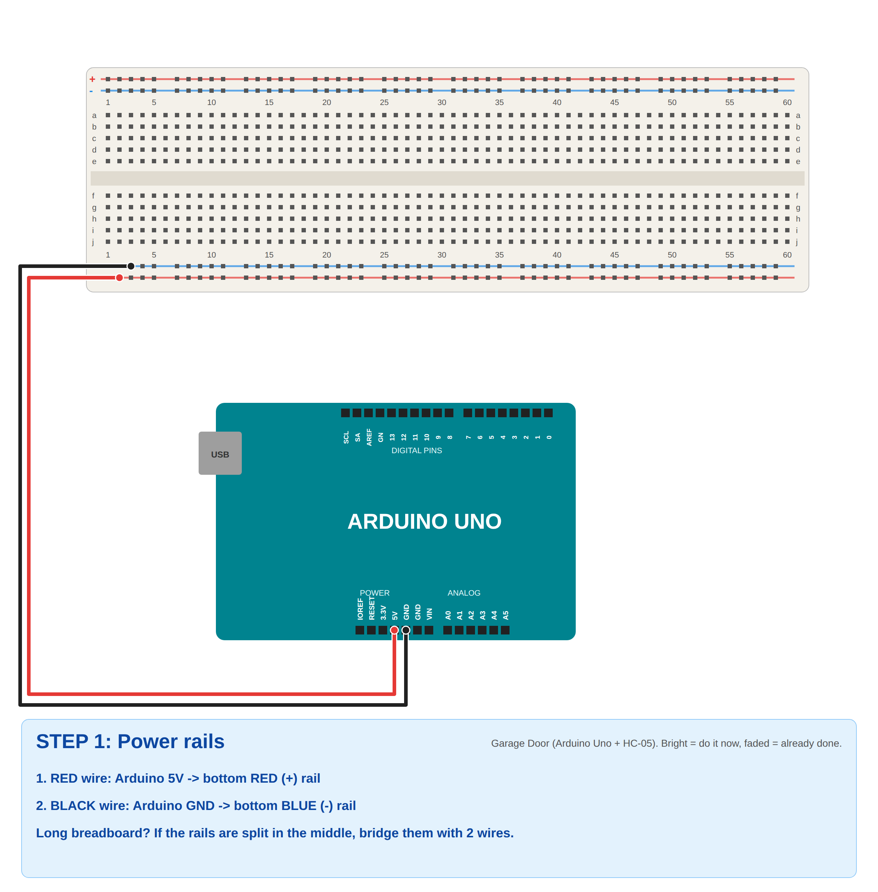
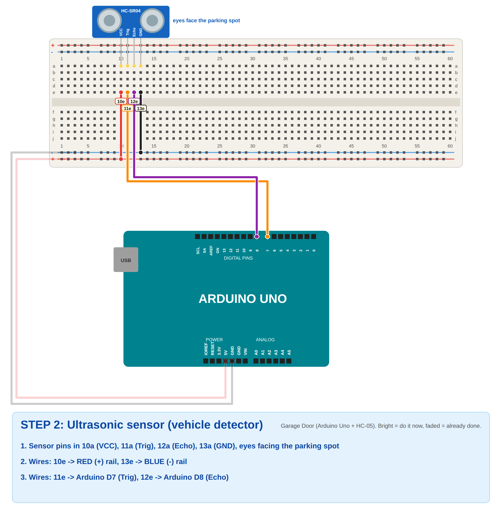
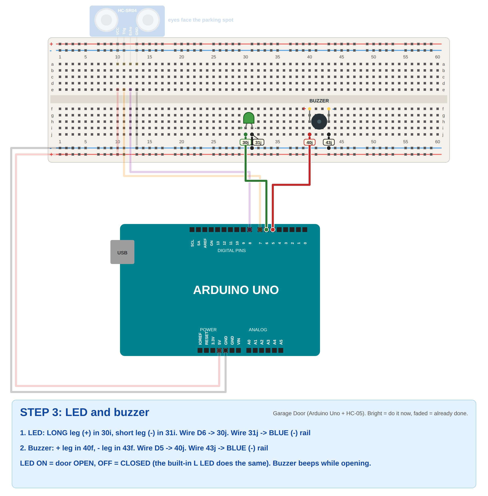
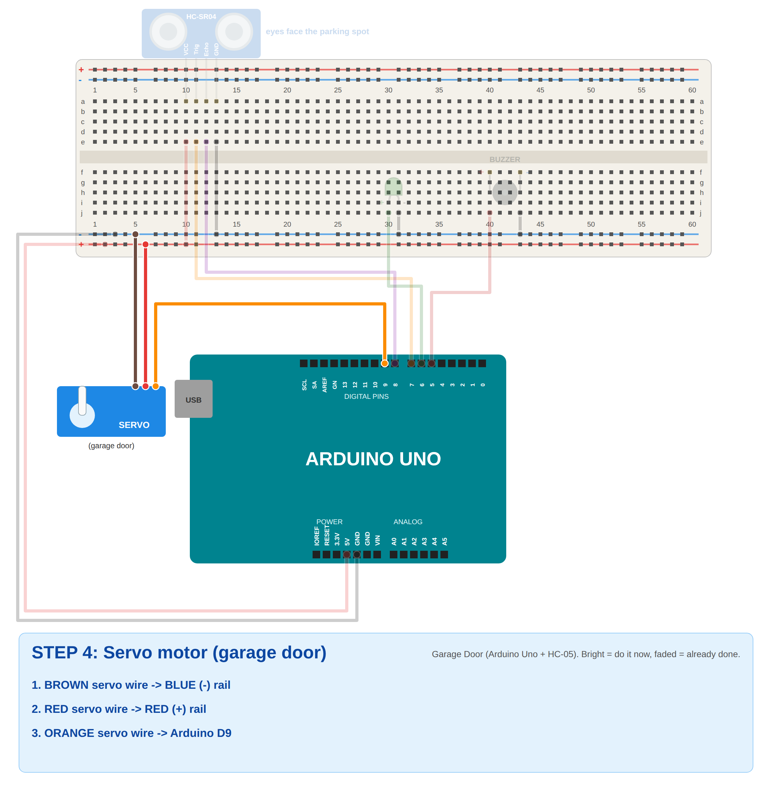
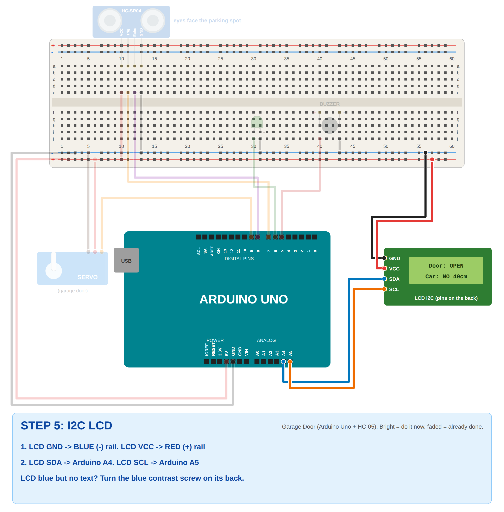
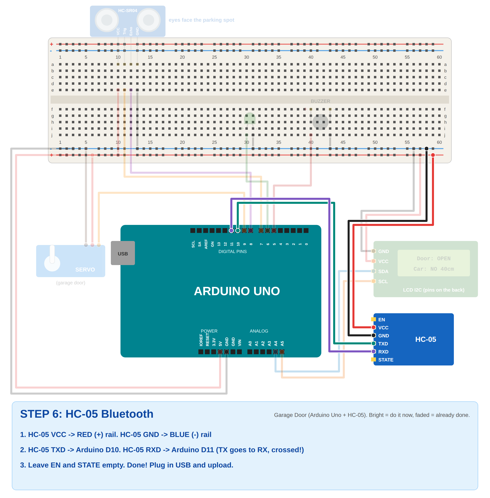
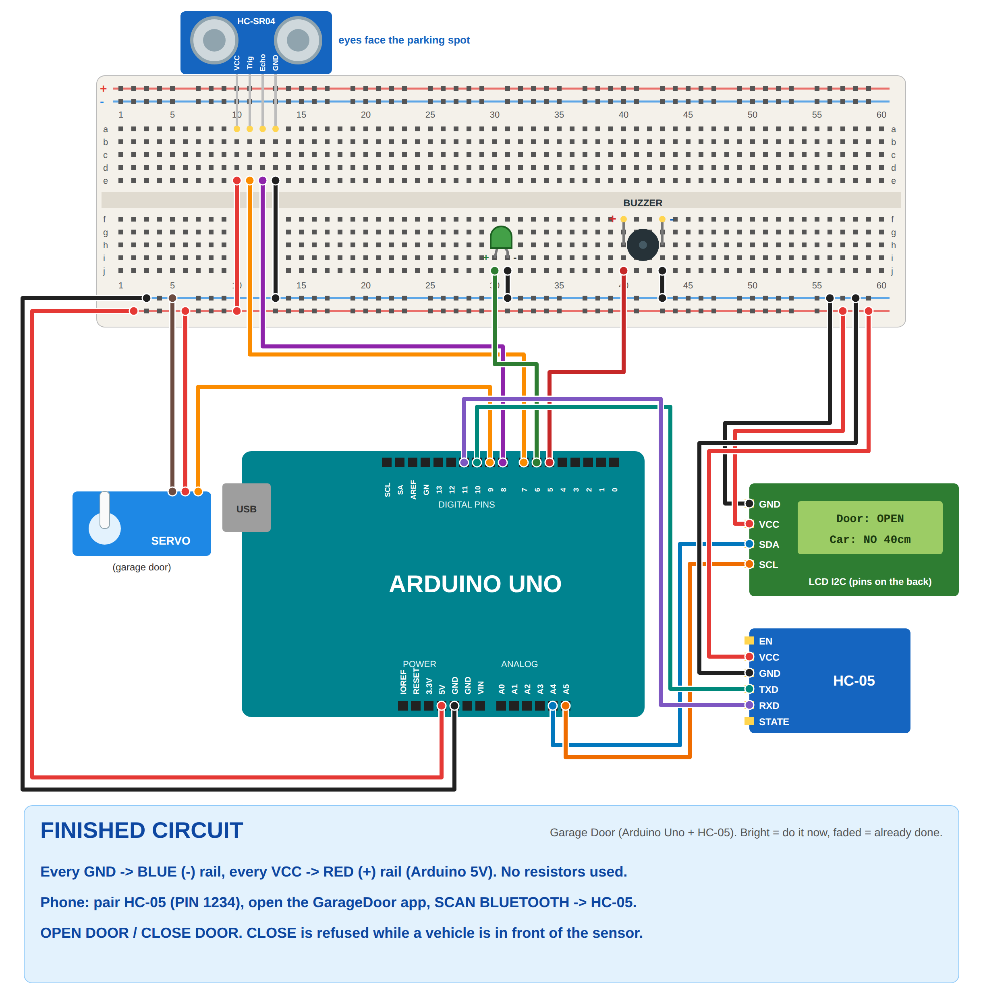

# Problem 14: Mobile-Controlled Garage Door (Arduino Uno + HC-05)

✅ **Verified:** compiles for **Arduino Uno** (41% flash, 48% RAM, no warnings). The door logic passes **24 simulated
tests** (`sim_test/run.sh`): open, close, close refused with a vehicle, door reopens if a car appears while closing,
buzzer only while opening, LED, LCD text. Timers don't clash: Servo = Timer1, buzzer `tone()` = Timer2, LED PWM = Timer0.

## What it does
| Phone sends | Vehicle in front of sensor? | Result |
|-------------|-----------------------------|--------|
| **OPEN** | doesn't matter | Door (servo) opens slowly 0° → 90°, **buzzer beeps while opening**, LED **ON**, LCD `Door: OPENING...` → `Door: OPEN` |
| **CLOSE** | **no** | Door closes 90° → 0°, LED **OFF**, LCD `Door: CLOSED` |
| **CLOSE** | **yes** (closer than 15 cm) | **Refused.** Door stays open, LCD `BLOCKED: Car in!`, phone shows "Cannot close: vehicle detected!" |
| *(car appears while closing)* | yes | Door **stops and opens again** (safety) |

How each requirement is met:
- **OPEN/CLOSE through the HC-05:** `SoftwareSerial` on D10/D11, 9600 baud.
- **Servo = garage door:** 0° closed, 90° open, 1° every 20 ms.
- **Ultrasonic detects a vehicle:** distance under `VEHICLE_CM` (15 cm).
- **No closing with a vehicle:** CLOSE is refused, and closing stops and reopens.
- **LED shows OPEN/CLOSED:** ON = open, OFF = closed. The built-in **L** LED copies it.
- **LCD shows door status:** line 1 `Door: ...`, line 2 `Car: YES/NO` + distance.
- **Buzzer during opening:** beeps 150 ms on/off only while opening.

## Components
- Arduino Uno + USB cable
- HC-05 Bluetooth module
- HC-SR04 ultrasonic sensor
- SG90 servo
- LED
- Buzzer
- I2C LCD 16x2
- Breadboard and jumper wires (male-female for the modules)

### No resistors? What that means on the Uno
- **LED:** normally needs a 220 Ω resistor. Without one, the code drives it with a **low PWM level** (`LED_LEVEL = 40`
  of 255), which keeps it safe. It's a bit dimmer. If you get a 220 Ω resistor, put it in series and set `LED_LEVEL = 255`.
- **HC-05 RXD:** officially wants 3.3V, and the Uno sends 5V. Connecting D11 straight to RXD is what most class
  projects do, and it works. The proper way is a 1 kΩ/2 kΩ divider if you ever get resistors.

## Wiring
| Part | Pin | Arduino Uno |
|------|-----|-------------|
| Breadboard **red +** rail | | **5V** |
| Breadboard **blue −** rail | | **GND** |
| HC-SR04 | VCC / GND | + rail / − rail |
| HC-SR04 | Trig | **D7** |
| HC-SR04 | Echo | **D8** |
| LED | long leg (+) | **D6** |
| LED | short leg (−) | − rail |
| Buzzer | + | **D5** |
| Buzzer | − | − rail |
| Servo | brown / red | − rail / + rail |
| Servo | orange | **D9** |
| LCD | GND / VCC | − rail / + rail |
| LCD | SDA | **A4** |
| LCD | SCL | **A5** |
| HC-05 | VCC / GND | + rail / − rail |
| HC-05 | **TXD** | **D10** |
| HC-05 | **RXD** | **D11** |
| HC-05 | EN, STATE | not connected |

TX goes to RX: HC-05 **TXD → D10** (Arduino receives), HC-05 **RXD ← D11** (Arduino sends).
The HC-05 can stay connected while uploading, because it doesn't use D0/D1.

## Step-by-step breadboard pictures
Bright = do it now, faded = already done. Yellow tags = exact hole (`30j` = column 30, row j).

| Step | |
|------|---|
| 1. Power |  |
| 2. Ultrasonic |  |
| 3. LED + buzzer |  |
| 4. Servo |  |
| 5. LCD |  |
| 6. HC-05 |  |
| Finished |  |

## Upload
1. **Tools → Board → Arduino AVR Boards → Arduino Uno**, then **Port → COMx**.
2. **Tools → Manage Libraries** → install **LiquidCrystal I2C** (Frank de Brabander). Servo, SoftwareSerial and Wire are built in.
3. Open `garage_door_uno.ino` → **Upload**.
4. **Serial Monitor at 9600.** Type `OPEN` → door opens with beeps. Type `CLOSE` → it closes.
   Hand in front of the sensor + `CLOSE` → `BLOCKED - VEHICLE DETECTED`.

## Phone (MIT App Inventor app `GarageDoor.aia`, same app as the ESP32 version)
1. Power the Arduino. The HC-05 LED **blinks fast**.
2. Phone **Settings → Bluetooth → pair HC-05**, PIN **1234** (or `0000`).
3. https://ai2.appinventor.mit.edu → **Projects → Import project (.aia)** → `GarageDoor.aia` → run with **AI Companion**
   or **Build → Android App (.apk)**.
4. **SCAN BLUETOOTH** → **HC-05**. The label turns green, and the HC-05 LED blinks slowly.
5. The app shows **DOOR OPEN / CLOSED / OPENING / CLOSING** and **Vehicle: DETECTED / none**.
6. **OPEN DOOR** / **CLOSE DOOR**. With a car in front: "Cannot close: vehicle detected!"

### App blocks (to explain)
| Block | What it does |
|-------|--------------|
| `lpBluetooth.BeforePicking` / `AfterPicking` | Lists paired devices, then connects to HC-05 |
| `btnOpen.Click` / `btnClose.Click` | `SendText "OPEN"` / `SendText "CLOSE"` |
| `Clock1.Timer` (200 ms) | Reads one line (`ReceiveText -1`, DelimiterByte 10). `VEHICLE: YES/NO` → vehicle label. `BLOCKED - VEHICLE DETECTED` → red message. Anything else → big door label. |

## Explaining the code
- **`state`** = `CLOSED / OPENING / OPEN / CLOSING`. The servo moves **1° every 20 ms**, so the door moves smoothly.
- **Every 100 ms:** `readDistanceCm()` → `vehicle = distance < 15`. A change is sent to the phone right away.
- **CLOSE:** `if (vehicle) blocked(); else startClosing();`. While closing, a vehicle → `blocked(); startOpening();`.
- **Buzzer:** `tone()`/`noTone()` every 150 ms, **only in OPENING**.
- **LED:** `setLed(true)` when opening starts, `setLed(false)` when fully closed.
- **HC-05:** `SoftwareSerial bt(10, 11)` at 9600. The status is also sent every 2 s.

## Settings
| In the code | Default | Change if... |
|-------------|---------|--------------|
| `VEHICLE_CM` | 15 | Your car / area is bigger or smaller |
| `DOOR_OPEN` / `DOOR_CLOSED` | 90 / 0 | The door moves the wrong way (swap them) |
| `STEP_MS` | 20 | Faster (smaller) / slower (bigger) door |
| `LED_LEVEL` | 40 | LED too dim (max 80 without a resistor, 255 with 220 Ω) |
| `lcd(0x27, ...)` | 0x27 | LCD only blue (try `0x3F` + turn the contrast screw) |

## Troubleshooting
| Problem | Fix |
|---------|-----|
| HC-05 not in the app list | Pair it first in phone Settings (PIN 1234) |
| Connected but no reaction | TXD/RXD swapped. HC-05 TXD → **D10**, RXD → **D11**. |
| Garbage / nothing on phone | HC-05 baud isn't 9600. Try `bt.begin(38400);`. |
| Servo twitches a little when the phone gets messages | Normal with SoftwareSerial. The door still works. |
| Always "Vehicle: DETECTED" | Something within 15 cm, or Trig/Echo swapped (Trig D7, Echo D8) |
| No beep | Buzzer + on D5, − on GND (check orientation) |
| LCD dark | Rails split in the middle of the breadboard (bridge them), LCD "LED" jumper on the back |
| LCD blue, no text | Turn the contrast screw. Try `0x3F`. SDA = A4, SCL = A5. |
