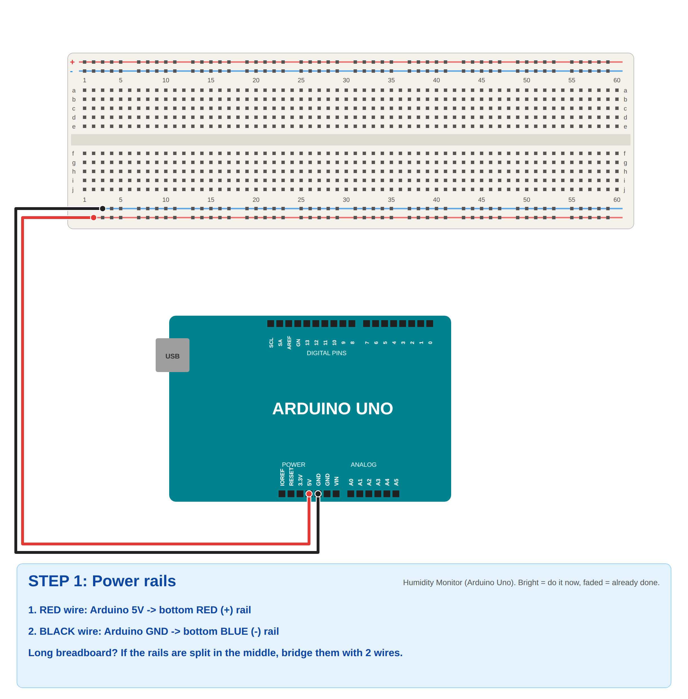
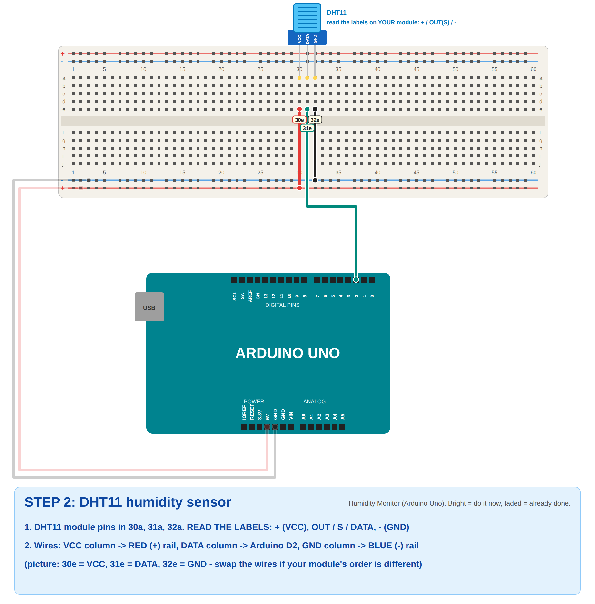
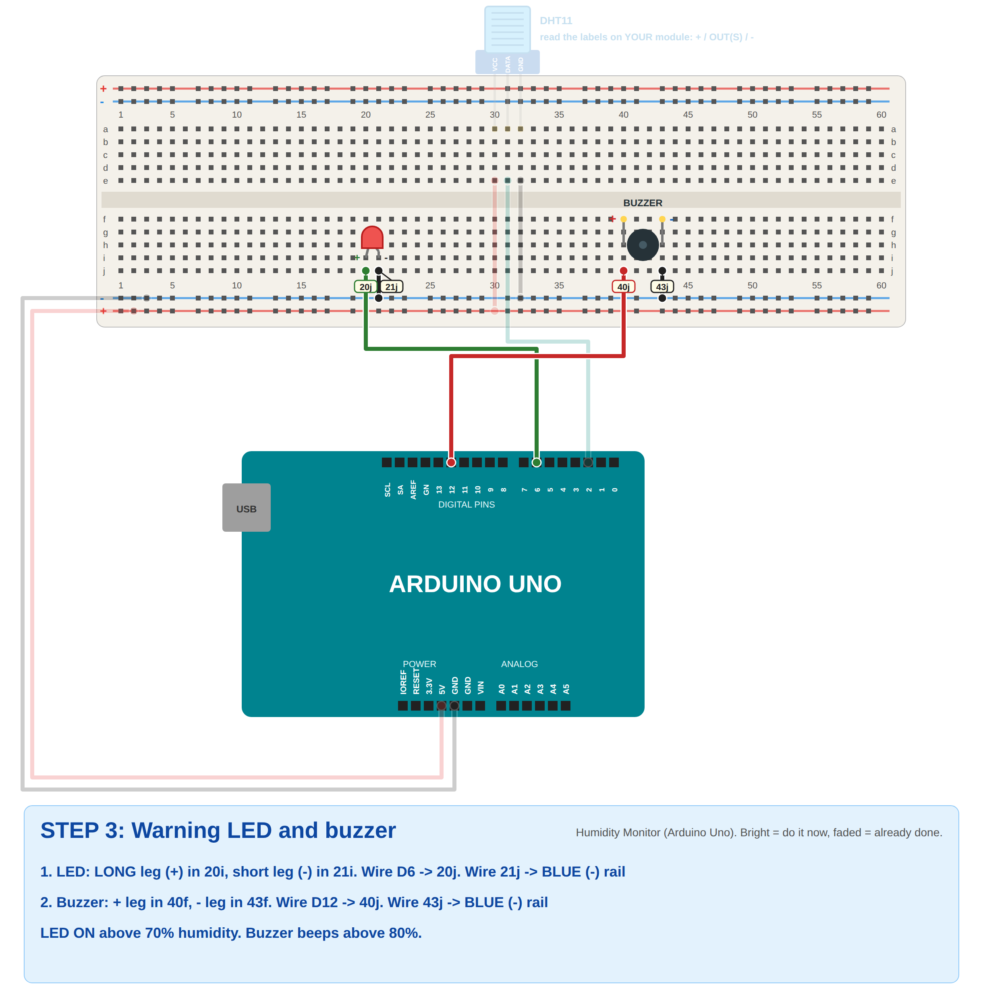
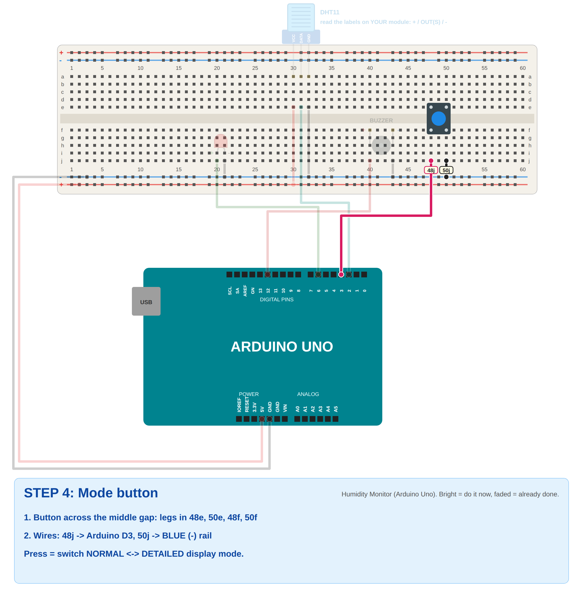
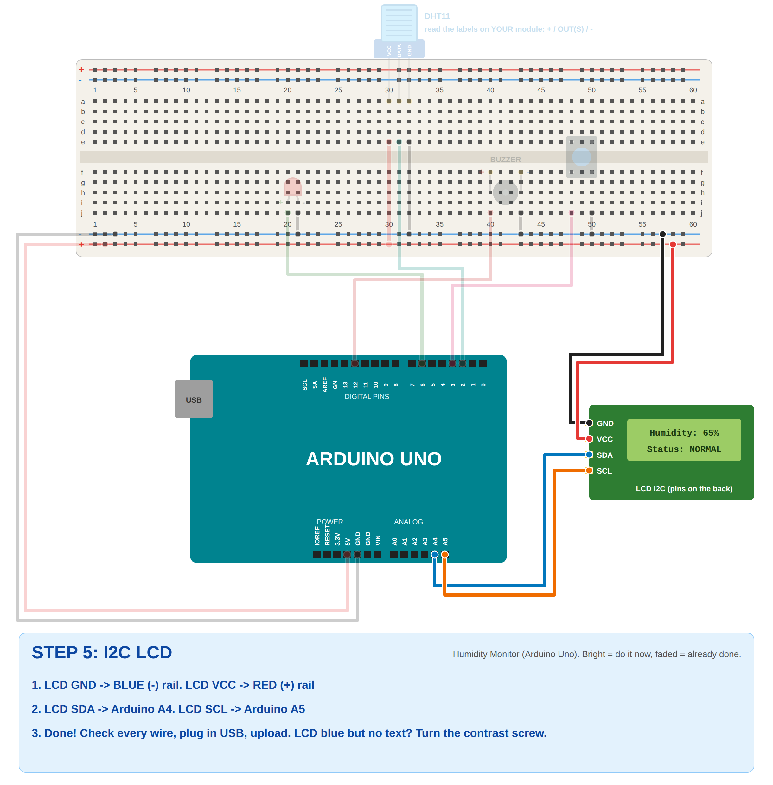
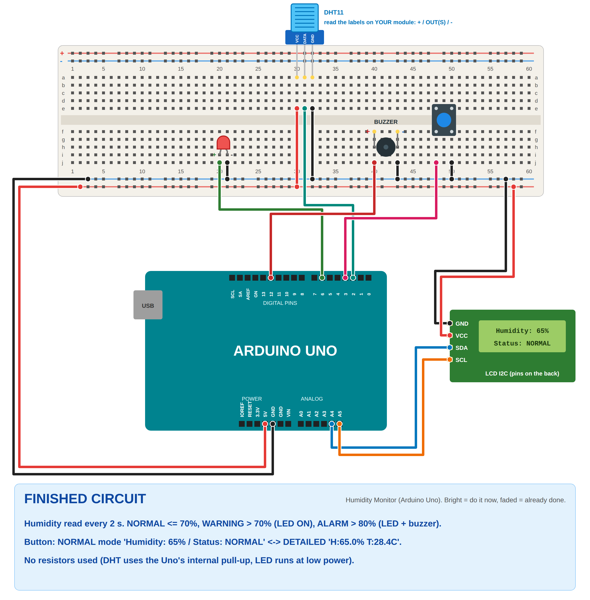

# Problem 4: Smart Temperature & Humidity Monitor (Arduino Uno)

✅ **Verified:** compiles for **Arduino Uno** with the real Adafruit DHT library (41% flash, 38% RAM, no warnings).
The logic passes **19 simulated tests** (`sim_test/run.sh`): exactly 70% / 80% are not "exceeding", LED above 70%,
buzzer beeping above 80%, both display modes, the button (with bounce and holding), and failed sensor reads.

## What it does
| Humidity | Status | Warning LED | Buzzer |
|----------|--------|-------------|--------|
| 70% or less | **NORMAL** | off | off |
| above 70% | **WARNING** | **ON** | off |
| above 80% | **ALARM** | **ON** | **beeping** |

LCD (press the button to switch modes):
```
NORMAL mode:          DETAILED mode:
Humidity: 65%         H:65.0% T:28.4C
Status: NORMAL        NORMAL   all OFF      (or "WARNING  LED ON" / "ALARM LED+BUZZER")
```
- The reading **updates every 2 seconds** (the DHT11 can't read faster).
- If the sensor isn't connected: `Humidity: --%` / `Check sensor!`. If one reading fails later, the last good value stays.

How each requirement is met:
- **Read humidity:** `dht.readHumidity()` every `READ_MS` (2 s).
- **Show humidity on the LCD:** line 1 `Humidity: 65%`.
- **LED on above 70%:** `humidity > 70.0` → `setLed(true)`.
- **Buzzer above 80%:** `humidity > 80.0` → beeps 200 ms on/off.
- **Button switches normal/detailed mode:** D3, debounced, toggles `detailedMode`.
- **Show humidity and system status:** both modes show the humidity and the status (NORMAL/WARNING/ALARM).
- **Continuous updates:** new reading and LCD refresh every 2 s.

## Components (no resistors)
- Arduino Uno + USB cable
- DHT11 humidity sensor (3-pin module or bare 4-pin)
- I2C LCD 16x2
- LED
- Buzzer
- Push button
- Breadboard and jumper wires

**Why no resistors?** The DHT library turns on the Uno's **internal pull-up** on D2 (a bare DHT11 normally wants 10 kΩ).
The LED runs at a **low PWM level** (`LED_LEVEL = 40`), so it's safe without a 220 Ω resistor.
The Uno's built-in **L** LED copies the warning LED.

## Wiring
| Part | Pin | Arduino Uno |
|------|-----|-------------|
| Breadboard **red +** rail | | **5V** |
| Breadboard **blue −** rail | | **GND** |
| DHT11 | **+ / VCC** | + rail |
| DHT11 | **OUT / S / DATA** | **D2** |
| DHT11 | **− / GND** | − rail |
| LED | long leg (+) | **D6** |
| LED | short leg (−) | − rail |
| Buzzer | + / − | **D12** / − rail |
| Button | one leg / diagonal leg | **D3** / − rail |
| LCD | GND / VCC | − rail / + rail |
| LCD | SDA / SCL | **A4** / **A5** |

⚠️ **DHT11 pin order differs between modules.** Read the labels printed on yours.
- **3-pin module:** labeled `+  OUT  −` or `S  +  −` or `VCC DATA GND`. Wire each label to the right place.
- **Bare 4-pin DHT11** (blue grille facing you, pins down, left to right): **1 = VCC, 2 = DATA, 3 = not used, 4 = GND**.

## Step-by-step breadboard pictures
Bright = do it now, faded = already done. Yellow tags = exact hole (`20j` = column 20, row j).

| Step | |
|------|---|
| 1. Power |  |
| 2. DHT11 |  |
| 3. LED + buzzer |  |
| 4. Button |  |
| 5. LCD |  |
| Finished |  |

## Upload and test
1. **Tools → Board → Arduino AVR Boards → Arduino Uno**, **Port → COMx**.
2. **Tools → Manage Libraries**, install:
   - **DHT sensor library** (by **Adafruit**). When it asks, click **Install all** (this also installs **Adafruit Unified Sensor**).
   - **LiquidCrystal I2C** (Frank de Brabander), if not installed yet.
3. Open `humidity_monitor_uno.ino` → **Upload**.
4. The LCD shows `Humidity: 55%` / `Status: NORMAL` (your room's value). Serial Monitor (9600) prints each reading.
5. **To test the warning:** **breathe slowly on the sensor** (or hold it in a closed hand). Humidity goes up →
   above 70% the **LED turns on** → above 80% the **buzzer beeps**. It comes back down after a minute.
6. Press the button → **DETAILED** mode (humidity with a decimal, temperature, and what the LED/buzzer are doing). Press again → NORMAL.

## Explaining the code
- **Every 2 s:** `readSensor()` reads humidity and temperature and sets `status`:
  ```
  if (humidity > 80) status = ALARM;
  else if (humidity > 70) status = WARNING;
  else status = NORMAL;
  ```
- **LED:** `setLed(status == WARNING || status == ALARM)`.
- **Buzzer:** while `status == ALARM`, `tone()`/`noTone()` every 200 ms (beeping). Otherwise silent.
- **Button:** `buttonPressed()` (50 ms debounce, once per press) → `detailedMode = !detailedMode` → `updateLcd()`.
- `updateLcd()` draws either the NORMAL screen or the DETAILED screen. Every line is padded to 16 characters, so no old characters are left behind.

## Settings
| In the code | Default | Change if... |
|-------------|---------|--------------|
| `DHT_TYPE` | DHT11 | You have the white DHT22 → `DHT22` |
| `LED_LIMIT` / `BUZZER_LIMIT` | 70 / 80 | The instructor gives other limits |
| `READ_MS` | 2000 | Keep it at 2000 or more for the DHT11 |
| `LED_LEVEL` | 40 | LED too dim (max about 80 without a resistor; 255 with 220 Ω) |
| `lcd(0x27, ...)` | 0x27 | LCD stays blue with no text (try `0x3F`, and turn the contrast screw) |

## Troubleshooting
| Problem | Fix |
|---------|-----|
| `Check sensor!` / Serial `DHT read failed` | DATA not on D2, or VCC/GND swapped. Check the module's labels. Bare 4-pin: pin 1 VCC, 2 DATA, 4 GND. |
| `DHT.h: No such file` | Install **DHT sensor library** by Adafruit (+ Adafruit Unified Sensor) |
| Humidity never changes | Normal, the DHT11 is slow. Breathe on it for 5–10 s and wait for the next reading. |
| LED doesn't light above 70% | Long leg on D6 (20i), short leg to GND (21i). The L LED on the Uno should light too. |
| No beep above 80% | Buzzer + on D12, − on GND |
| Button doesn't switch | Use **diagonal** legs: 48j → D3, 50j → GND. The button must cross the middle gap. |
| LCD dark / blue only | Rails split in the middle (bridge them), contrast screw, address `0x3F`, SDA = A4, SCL = A5 |
