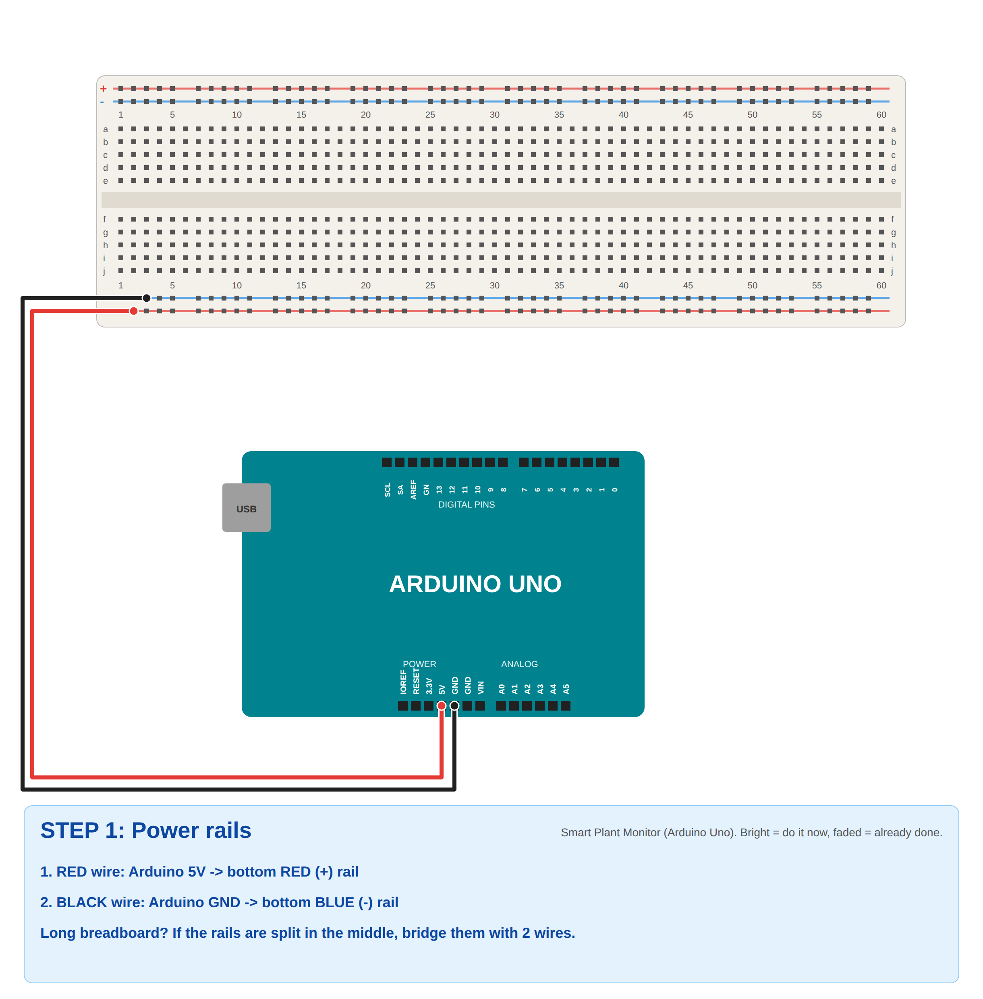
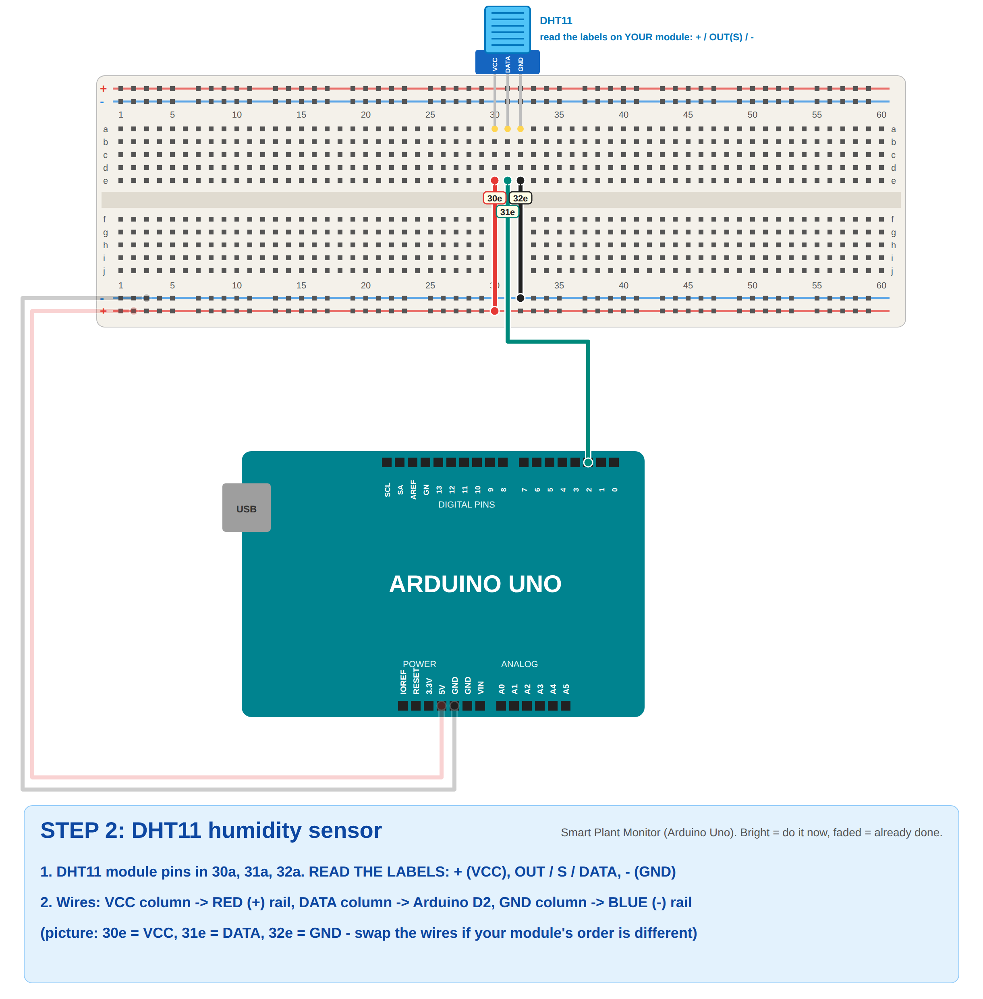
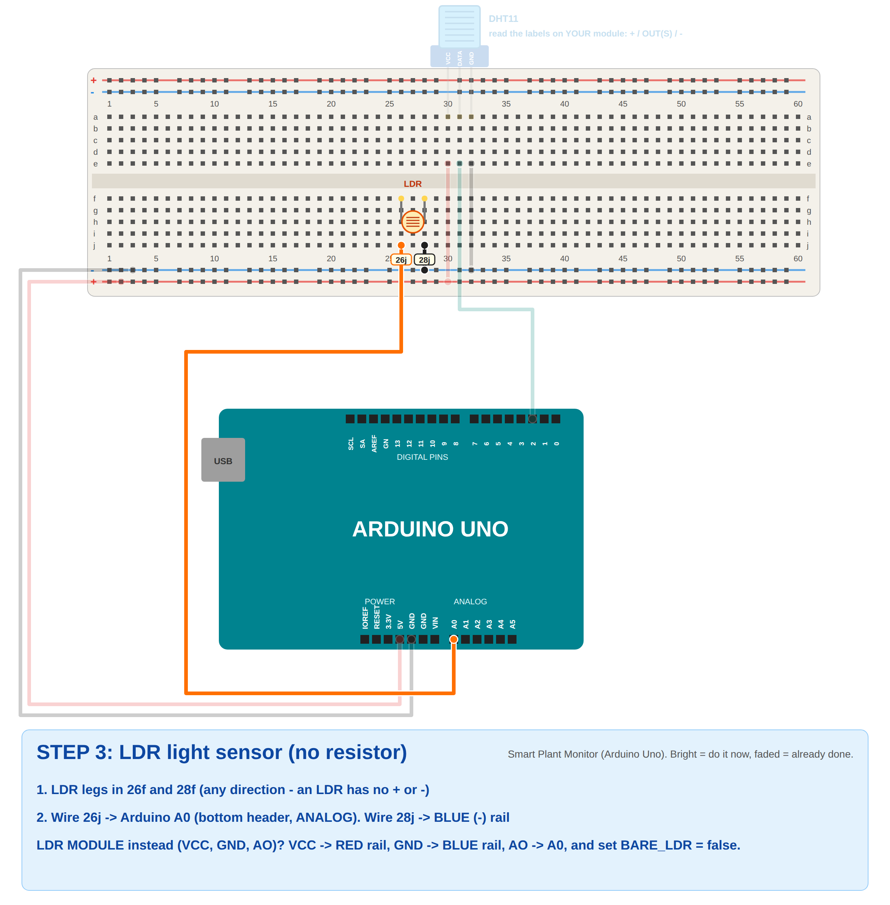
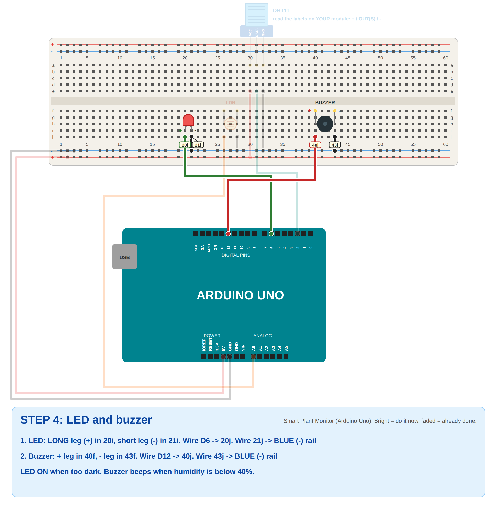
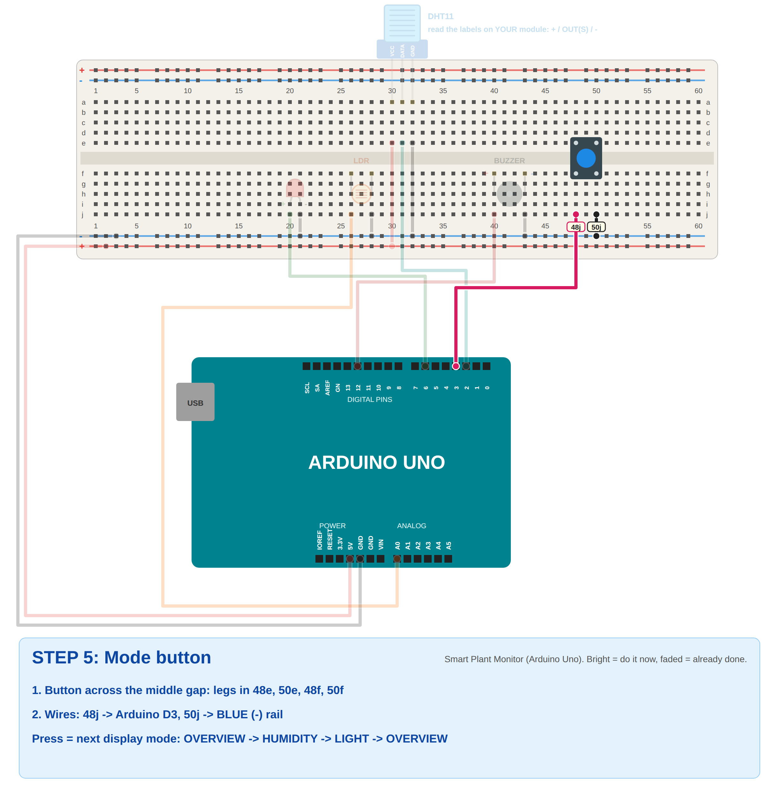
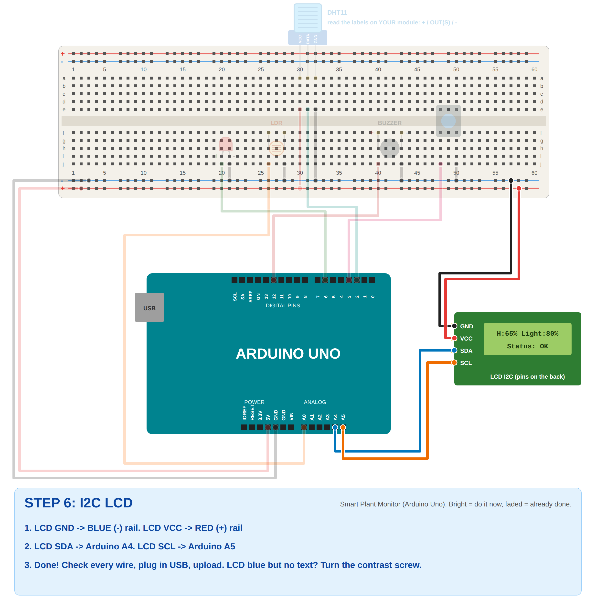
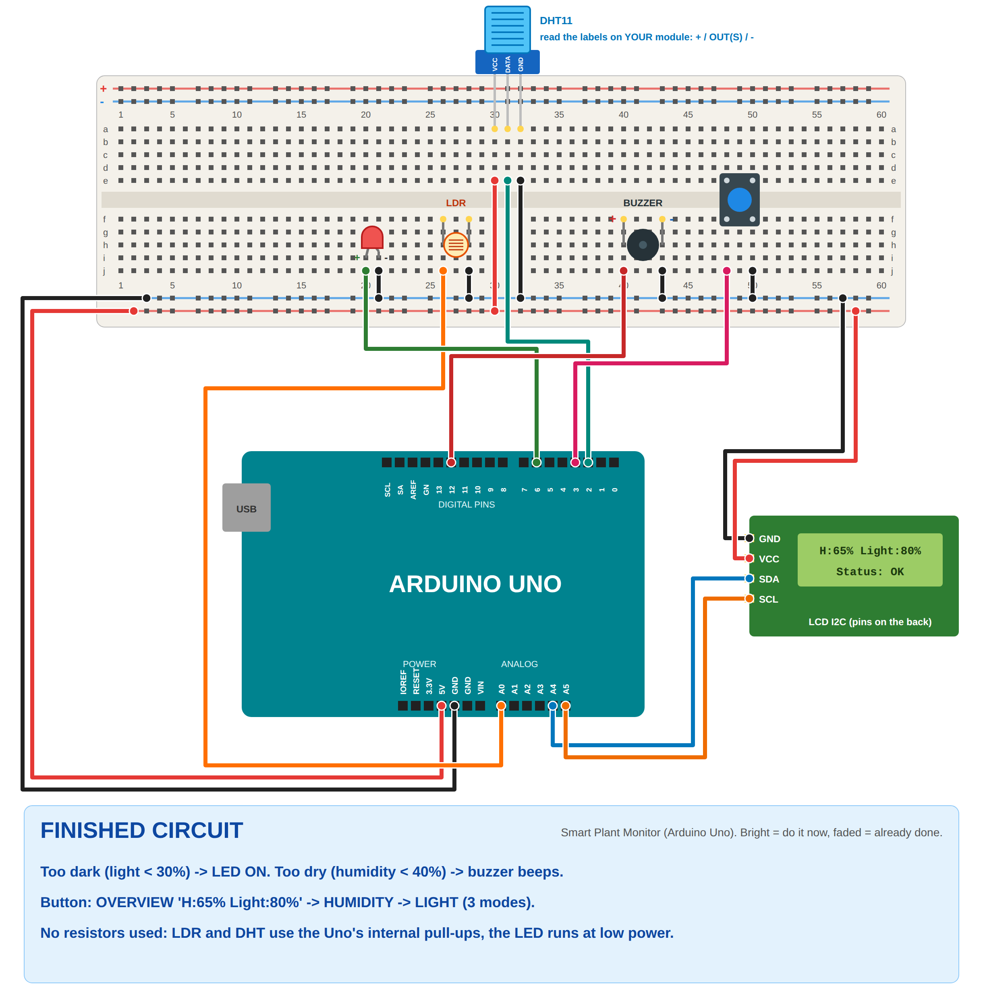

# Problem 16: Smart Plant Monitoring System (Arduino Uno)

✅ **Verified:** compiles for **Arduino Uno** with the real Adafruit DHT library (41% flash, 38% RAM, no warnings).
The logic passes **20 simulated tests** (`sim_test/run.sh`): LED on when dark (with no flicker at the edge), buzzer
below the humidity threshold (exactly 40% stays silent), dry + dark together, all 3 display modes, button (bounce and
holding), longest LCD lines fit in 16 characters, failed DHT readings.

## What it does
| Condition | LED | Buzzer | LCD status |
|-----------|-----|--------|------------|
| Bright and humidity ≥ 40% | off | off | `Status: OK` |
| **Too dark** (light < 30%) | **ON** | off | `Status: DARK` |
| **Too dry** (humidity < 40%) | off | **beeping** | `Status: DRY` |
| Dark **and** dry | **ON** | **beeping** | `Status: DRY+DARK` |

Display modes (the button cycles through them):
```
OVERVIEW            HUMIDITY            LIGHT
H:65% Light:80%     Humidity: 65.0%     Light:80% r205      (r = raw A0 reading 0-1023)
Status: OK          Min 40%: OK         LED OFF - BRIGHT
```
- **Continuous monitoring:** light every 0.2 s, humidity every 2 s (the DHT11 can't go faster).
- **No flicker:** the LED turns on below 30% light and only turns off above 35%.

How each requirement is met:
- **Humidity sensor monitors humidity:** DHT11 on D2, `dht.readHumidity()` every 2 s.
- **LDR monitors light:** LDR on A0, shown as **Light %** (0 = dark, 100 = bright).
- **Humidity and light status on the LCD:** OVERVIEW shows both plus the status.
- **LED on when too dark:** `lightPercent < DARK_PERCENT` (30).
- **Buzzer when humidity below the threshold:** `humidity < HUMIDITY_MIN` (40%) → beeps.
- **Button switches display modes:** OVERVIEW → HUMIDITY → LIGHT → ...
- **Continuous monitoring:** the loop never stops; the readings refresh all the time.

## Components (no resistors)
- Arduino Uno + USB cable
- DHT11 humidity sensor
- LDR (photoresistor), bare or module
- I2C LCD 16x2
- LED
- Buzzer
- Push button
- Breadboard and jumper wires

**How it works without resistors:**
- **Bare LDR:** normally needs a 10 kΩ resistor. The code turns on the Uno's **internal pull-up** on A0
  (`pinMode(A0, INPUT_PULLUP)`), which takes the resistor's place. Wire the LDR straight from **A0 to GND**.
- **DHT11:** the DHT library uses the internal pull-up on D2.
- **LED:** low PWM level (`LED_LEVEL = 40`). The Uno's **L** LED copies it.

## Wiring
| Part | Pin | Arduino Uno |
|------|-----|-------------|
| Breadboard **red +** rail | | **5V** |
| Breadboard **blue −** rail | | **GND** |
| DHT11 | + / VCC | + rail |
| DHT11 | OUT / S / DATA | **D2** |
| DHT11 | − / GND | − rail |
| **LDR (bare)** | leg 1 | **A0** |
| **LDR (bare)** | leg 2 | − rail (GND) |
| LED | long leg (+) | **D6** |
| LED | short leg (−) | − rail |
| Buzzer | + / − | **D12** / − rail |
| Button | one leg / diagonal leg | **D3** / − rail |
| LCD | GND / VCC | − rail / + rail |
| LCD | SDA / SCL | **A4** / **A5** |

**LDR module instead of a bare LDR?** (Small board with VCC, GND, AO, DO.) Wire VCC → + rail, GND → − rail,
**AO → A0** (leave DO empty), and set `BARE_LDR = false` in the code.

**DHT11 pin order differs between modules.** Read your labels (`+ OUT −`, `S + −`...).
Bare 4-pin DHT11: 1 = VCC, 2 = DATA, 3 = empty, 4 = GND.

## Step-by-step breadboard pictures
Bright = do it now, faded = already done. Yellow tags = exact hole (`26j` = column 26, row j).

| Step | |
|------|---|
| 1. Power |  |
| 2. DHT11 |  |
| 3. LDR |  |
| 4. LED + buzzer |  |
| 5. Button |  |
| 6. LCD |  |
| Finished |  |

## Upload and test
1. **Tools → Board → Arduino AVR Boards → Arduino Uno**, **Port → COMx**.
2. Libraries (if not installed yet): **DHT sensor library** by Adafruit (**Install all**), **LiquidCrystal I2C** (Frank de Brabander).
3. Open `plant_monitor_uno.ino` → **Upload**.
4. **Light test:** cover the LDR with your finger → Light % drops below 30 → **LED ON**, `Status: DARK`.
   Uncover it → LED off.
5. **Humidity test:** the buzzer sounds when humidity is **below 40%**.
   - If your room is already below 40%, it beeps right away (that's correct!). Breathe on the DHT11 → humidity rises → beeping stops.
   - If your room is above 40%, raise `HUMIDITY_MIN` to just above the room's value (for example 70) to demonstrate it,
     or ask the instructor which threshold to use.
6. Press the button → HUMIDITY mode → LIGHT mode → back to OVERVIEW.
7. Serial Monitor (9600) prints humidity, light % and the raw LDR value every 2 s.

## Explaining the code
- `readLight()`: `analogRead(A0)` → `lightPercent = map(raw, 0, 1023, 100, 0)`. More light means a lower raw value,
  so the map flips it so 100% = bright. Then **too dark** = below 30% (and back to bright only above 35%).
- `readHumidity()`: `dht.readHumidity()` every 2 s → `tooDry = humidity < 40`.
- **LED:** `analogWrite(LED_PIN, tooDark ? LED_LEVEL : 0)`.
- **Buzzer:** while `tooDry`, `tone()`/`noTone()` every 300 ms (beeping).
- **Button:** `buttonPressed()` (50 ms debounce, once per press) → `mode = (mode + 1) % 3` → `updateLcd()`.

## Settings
| In the code | Default | Change if... |
|-------------|---------|--------------|
| `HUMIDITY_MIN` | 40.0 | The instructor gives another threshold ("specified threshold") |
| `DARK_PERCENT` | 30 | The LED turns on too early (smaller) or too late (bigger). Check the % in LIGHT mode. |
| `BARE_LDR` | true | You use an LDR **module** (AO → A0) → `false` |
| `INVERT_LIGHT` | false | Light % goes **down** when you shine light on it → `true` |
| `DHT_TYPE` | DHT11 | White DHT22 → `DHT22` |
| `lcd(0x27, ...)` | 0x27 | LCD stays blue with no text (try `0x3F` + contrast screw) |

## Troubleshooting
| Problem | Fix |
|---------|-----|
| Light always 0% or 100% | LDR not between A0 and GND (columns 26 and 28), or using a module with `BARE_LDR = true` |
| Light % backwards (dark = high %) | Set `INVERT_LIGHT = true` |
| LED never turns on | Cover the LDR fully. Check the % in LIGHT mode. Raise `DARK_PERCENT` if needed. Long leg on D6. |
| `H:--%` / Serial `DHT read failed` | DHT DATA not on D2, or VCC/GND swapped. Check the module labels. |
| Buzzer always beeping | Your room is below 40%. That's correct behavior. Breathe on the DHT11 to test, or change `HUMIDITY_MIN`. |
| Button doesn't switch | Use **diagonal** legs: 48j → D3, 50j → GND. The button must cross the middle gap. |
| LCD dark / blue only | Rails split in the middle (bridge them), contrast screw, address `0x3F`, SDA = A4, SCL = A5 |
