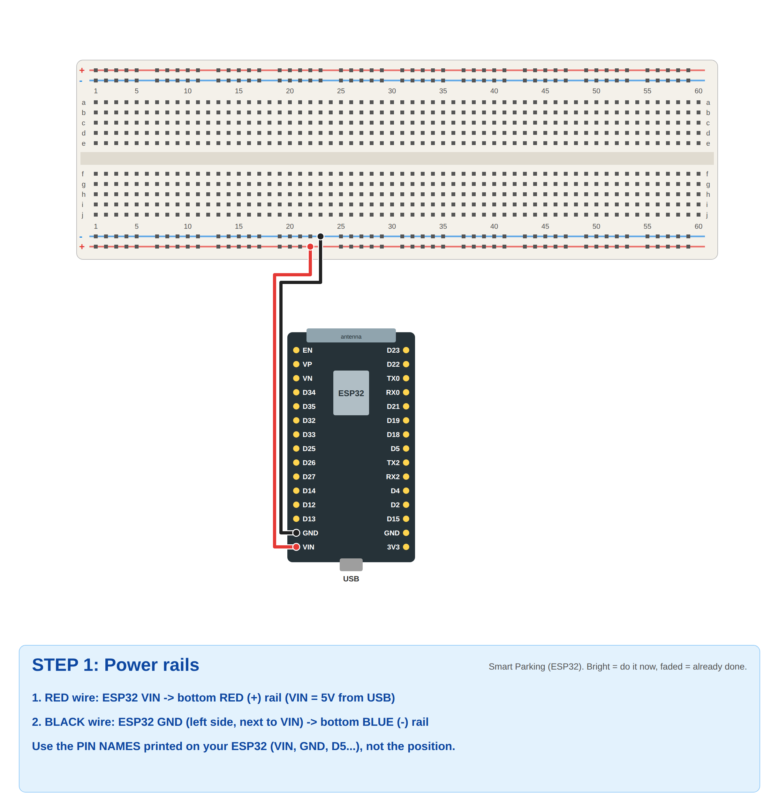
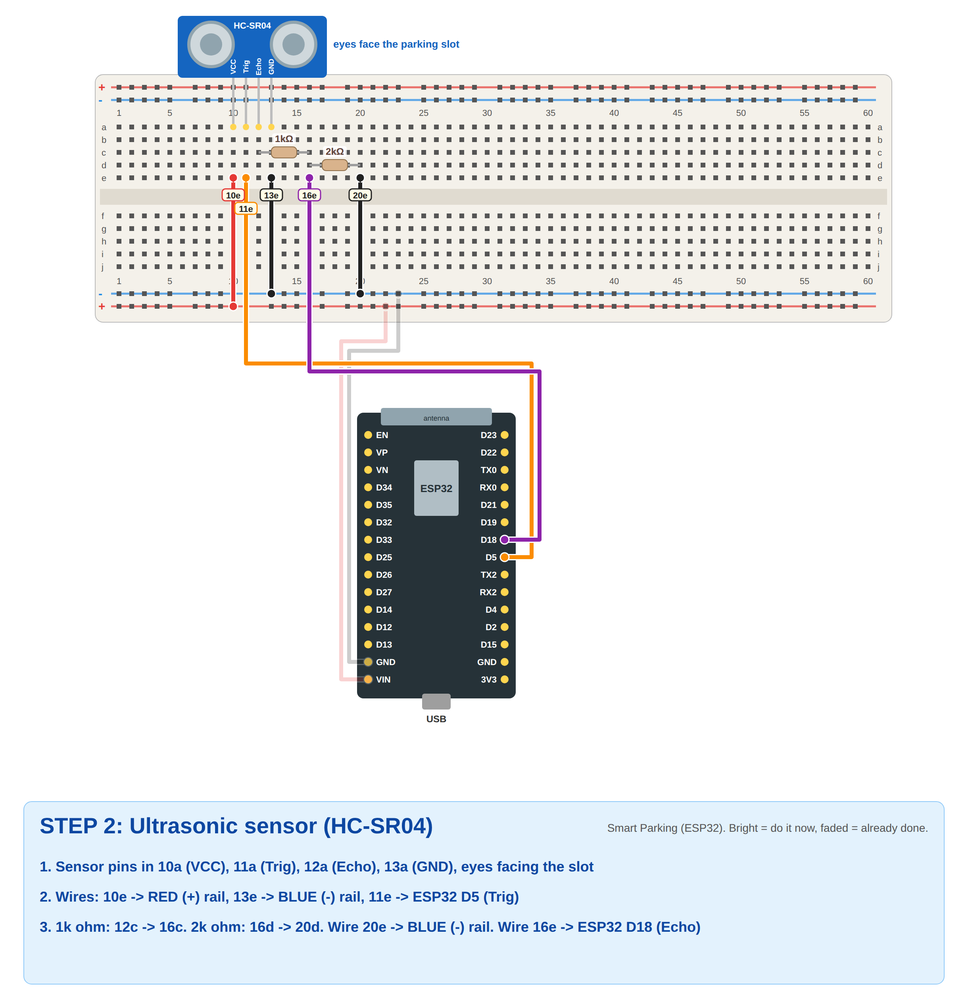
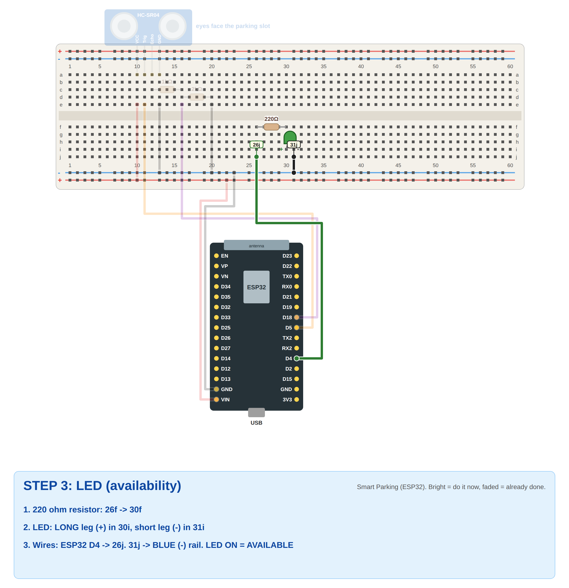
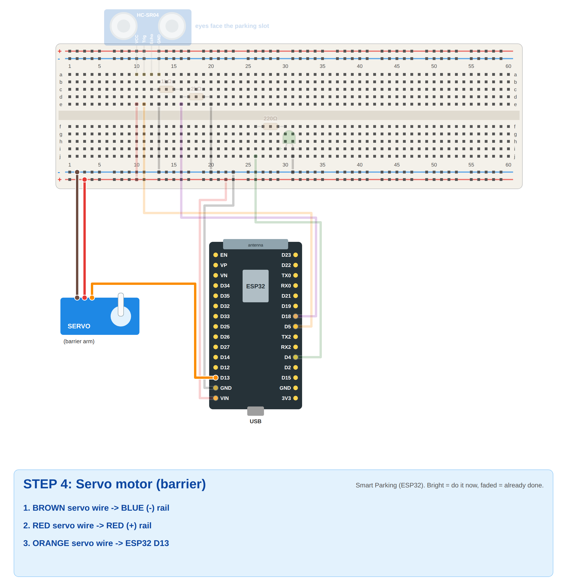
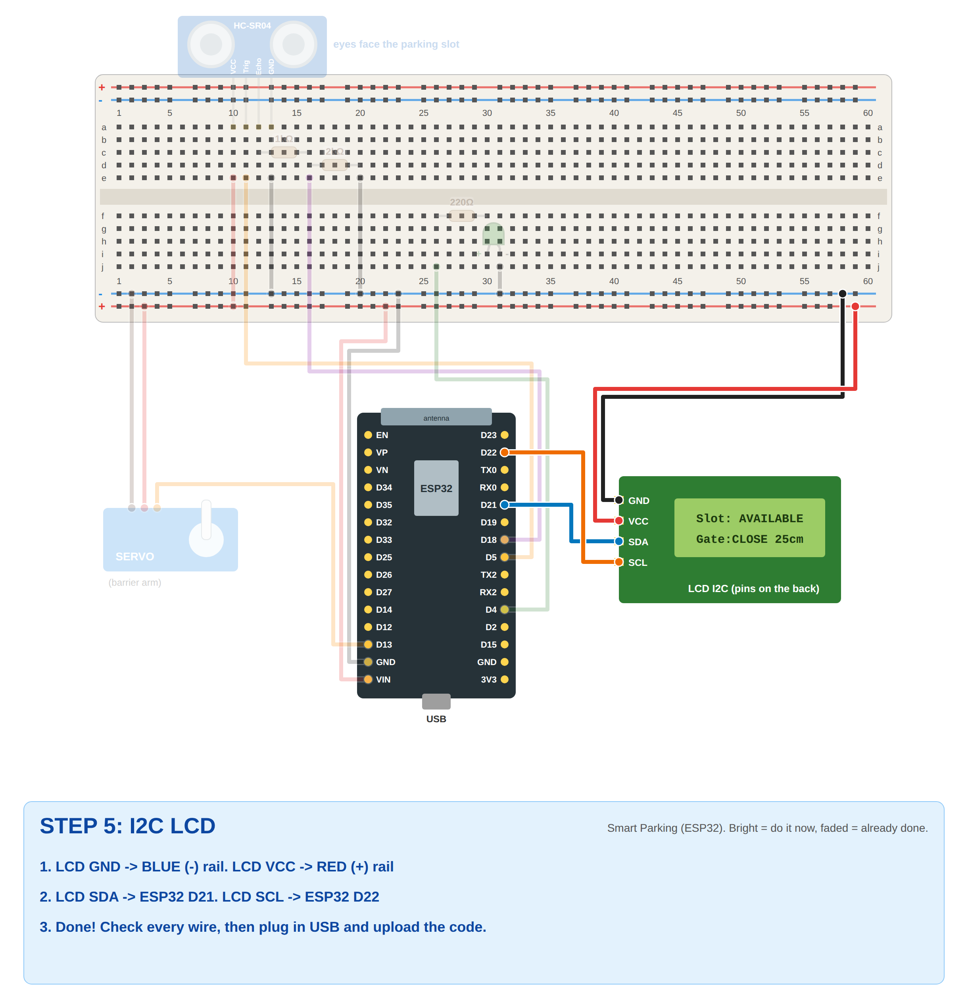
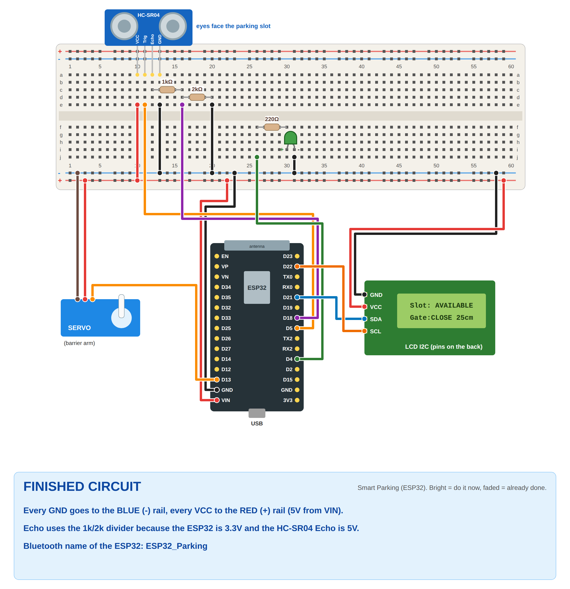

# Problem 19: Smart Parking Monitoring with Mobile App (ESP32)

✅ **The code compiles** for *ESP32 Dev Module* (ESP32 Arduino core 3.3.12): 84% of flash, so the default partition is fine.

## What it does
| Situation | LED | LCD | App | Gate (servo) |
|-----------|-----|-----|-----|--------------|
| Nothing within 10 cm of the sensor | **ON** | `Slot: AVAILABLE` | **AVAILABLE** (green) | closed (0°) |
| Car/object closer than 10 cm | OFF | `Slot: OCCUPIED` | **OCCUPIED** (red) | closed |
| Press **OPEN GATE** while AVAILABLE | ON | `Gate:OPEN` | `GATE OPENED` | opens (90°), closes after 5 s → `GATE CLOSED` |
| Press **OPEN GATE** while OCCUPIED | OFF | `Gate:CLOSE` | `DENIED - SLOT OCCUPIED` | **stays closed** |

How each requirement is met:
- **Ultrasonic decides OCCUPIED / AVAILABLE:** `distance < 10 cm` = OCCUPIED (`OCCUPIED_CM` in the code).
- **Servo = parking barrier:** 0° closed, 90° open.
- **LED shows availability:** ON = AVAILABLE, OFF = OCCUPIED.
- **Status shown in MIT App Inventor:** the ESP32 sends `AVAILABLE`/`OCCUPIED` every second and on every change.
- **App button sends OPEN GATE:** the **OPEN GATE** button sends `OPEN` over Bluetooth.
- **Gate opens when the command arrives:** `openGate()`.
- **Never opens when occupied:** `if (occupied) send("DENIED - SLOT OCCUPIED")`.

## Components
- ESP32 DevKit (**classic ESP32**: ESP32-WROOM/DevKit V1. ESP32-S3/C3 don't have Bluetooth Classic.)
- HC-SR04 ultrasonic sensor + **1 kΩ and 2 kΩ** resistors (Echo voltage divider). If you have no 2 kΩ, use two 1 kΩ in series.
- SG90 servo
- 1 LED + **220 Ω** resistor
- LCD 16x2 with I2C backpack
- Breadboard, jumper wires (male-female for the ESP32 and LCD)

## Wiring
| Part | Pin | ESP32 |
|------|-----|-------|
| Power | breadboard red **+** rail | **VIN** (5V from USB) |
| Power | breadboard blue **−** rail | **GND** |
| HC-SR04 | VCC | + rail (5V) |
| HC-SR04 | GND | − rail |
| HC-SR04 | Trig | **D5** |
| HC-SR04 | Echo | 1 kΩ → **D18**, and 2 kΩ from D18 to GND |
| LED | long leg (+) through 220 Ω | **D4** |
| LED | short leg (−) | − rail |
| Servo | brown | − rail |
| Servo | red | + rail |
| Servo | orange | **D13** |
| LCD | GND | − rail |
| LCD | VCC | + rail |
| LCD | SDA | **D21** |
| LCD | SCL | **D22** |

Use the **pin names printed on your board** (VIN, D5, D18...). On a 38-pin ESP32, the positions are different but the names are the same.

## Step-by-step breadboard pictures
Bright = do it now, faded = already done. Yellow tags = exact hole (`10a` = column 10, row a).

| Step | |
|------|---|
| 1. Power |  |
| 2. Ultrasonic + divider |  |
| 3. LED |  |
| 4. Servo |  |
| 5. LCD |  |
| Finished |  |

## Upload the code
1. Arduino IDE → **Tools → Board → esp32 → ESP32 Dev Module**, then **Port → COMx**.
2. **Tools → Manage Libraries** → install **ESP32Servo** and **LiquidCrystal I2C** (Frank de Brabander).
   (BluetoothSerial and Wire come with the ESP32 board package.)
3. Open `smart_parking.ino` → **Upload**. If it gets stuck on `Connecting....`, hold **BOOT**.
4. **Serial Monitor at 115200.** You see `AVAILABLE` every second. Put your hand close to the sensor and it prints `OCCUPIED`.
   Type `OPEN` and press Enter to test the gate without the phone.

## MIT App Inventor app (`SmartParking.aia`)
1. **Pair** (once): phone **Settings → Bluetooth → Pair new device → ESP32_Parking** (no PIN, or `1234` if asked).
2. https://ai2.appinventor.mit.edu → **Projects → Import project (.aia) from my computer** → `SmartParking.aia`.
3. Run it with **Connect → AI Companion**, or **Build → Android App (.apk)** and install it.
4. Tap **SCAN BLUETOOTH**, **Allow** "Nearby devices", then choose **ESP32_Parking**. The label turns green.
5. The big text shows **AVAILABLE** (green) or **OCCUPIED** (red) and updates every second.
6. Tap **OPEN GATE**:
   - AVAILABLE: the servo opens, the app shows `GATE OPENED`, then `GATE CLOSED` 5 s later.
   - OCCUPIED: the gate stays closed, and the app shows `DENIED - SLOT OCCUPIED`.

### App blocks (to explain to the instructor)
| Block | What it does |
|-------|--------------|
| `lpBluetooth.BeforePicking` / `AfterPicking` | Lists paired devices, then connects to the chosen one |
| `btnOpenGate.Click` | `BluetoothClient1.SendText "OPEN"`: the OPEN GATE command |
| `Clock1.Timer` (every 200 ms) | Reads one line (`ReceiveText -1`, DelimiterByte 10 = newline). `AVAILABLE`/`OCCUPIED` updates the big status (green/red). Anything else (`GATE OPENED`, `DENIED - SLOT OCCUPIED`, `GATE CLOSED`) goes to the gate label. |
| `btnDisconnect.Click` | `BluetoothClient1.Disconnect` |

## Explaining the ESP32 code
- `readDistanceCm()`: sends a 10 µs Trig pulse, measures the Echo time with `pulseIn`, and converts it to cm (`× 0.034 / 2`).
- **Every 200 ms:** reads the distance, sets `occupied`, sets the LED, and updates the LCD.
- **Every 1 s:** sends `AVAILABLE`/`OCCUPIED` to the app over `BluetoothSerial`.
- `handleCommand()`: on `OPEN`, if occupied it sends `DENIED - SLOT OCCUPIED`, otherwise `openGate()` (servo 90°).
- **After 5 s:** `closeGate()` (servo 0°).

## Settings you may need to change
| Setting in the code | Default | Change if... |
|---------------------|---------|--------------|
| `OCCUPIED_CM` | 10 | Your toy car / slot is bigger (for example 15 or 20) |
| `GATE_OPEN` / `GATE_CLOSED` | 90 / 0 | The barrier moves the wrong way (swap them) |
| `OPEN_TIME_MS` | 5000 | The gate should stay open longer or shorter |
| `lcd(0x27, ...)` | 0x27 | The LCD is blank (try `0x3F`) |

## Troubleshooting
| Problem | Fix |
|---------|-----|
| Always AVAILABLE | Check Trig = D5, Echo = D18 (through the 1k), VCC = 5V (VIN, not 3V3) |
| Always OCCUPIED | Something is in front of the sensor, or `OCCUPIED_CM` is too big |
| `BluetoothSerial.h` error / "Bluetooth not enabled" | Board must be **ESP32 Dev Module** (classic ESP32), not S3/C3 |
| ESP32_Parking not in the app list | Pair it first in phone Settings → Bluetooth |
| App connects but shows `---` | Wait 1 s. Check the ESP32 is running (Serial Monitor shows AVAILABLE/OCCUPIED). |
| Servo jitters / ESP32 restarts | Servo power from VIN (5V), not 3V3. A weak USB port: try another port or cable. |
| LCD backlight but no text | Turn the blue contrast screw. Try address `0x3F`. |
