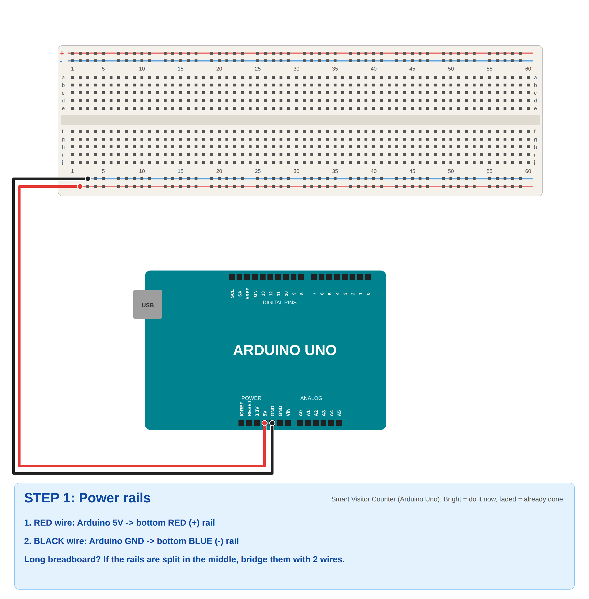
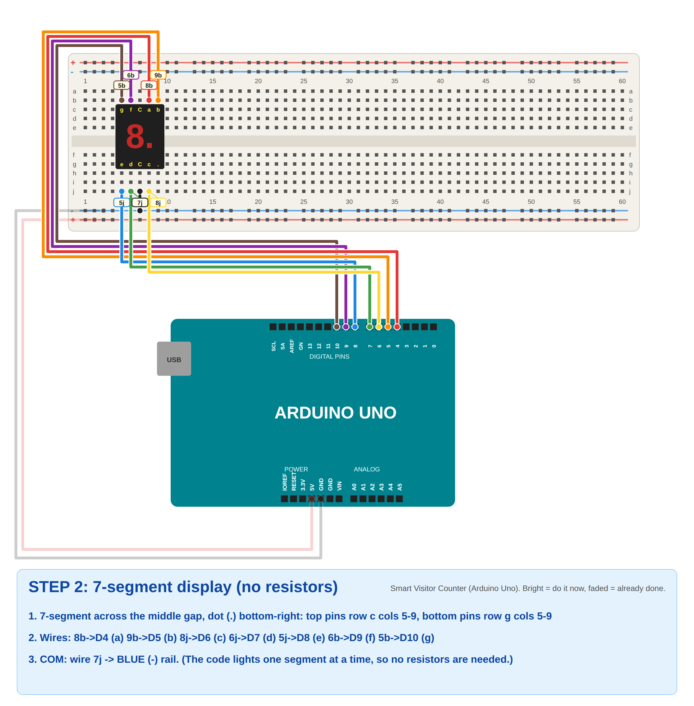
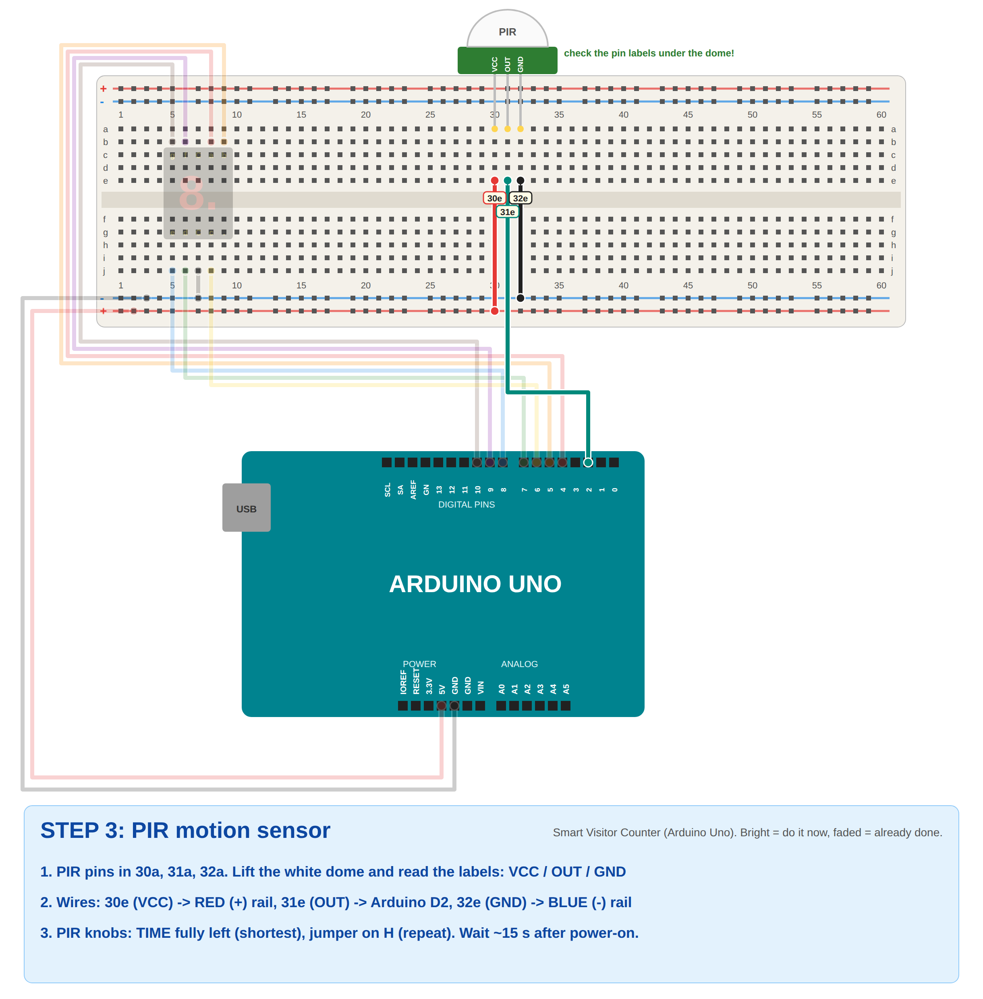
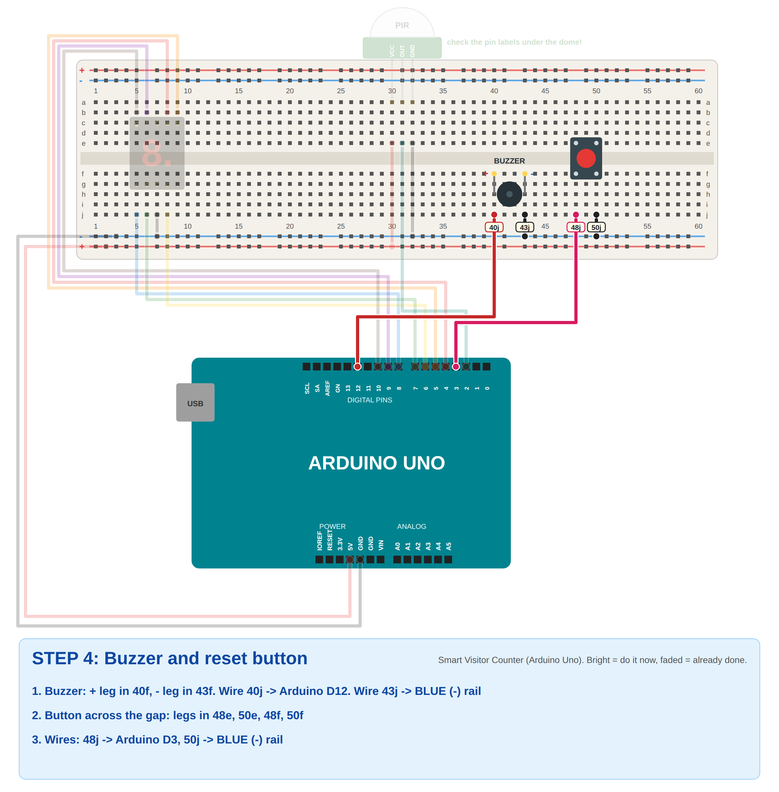
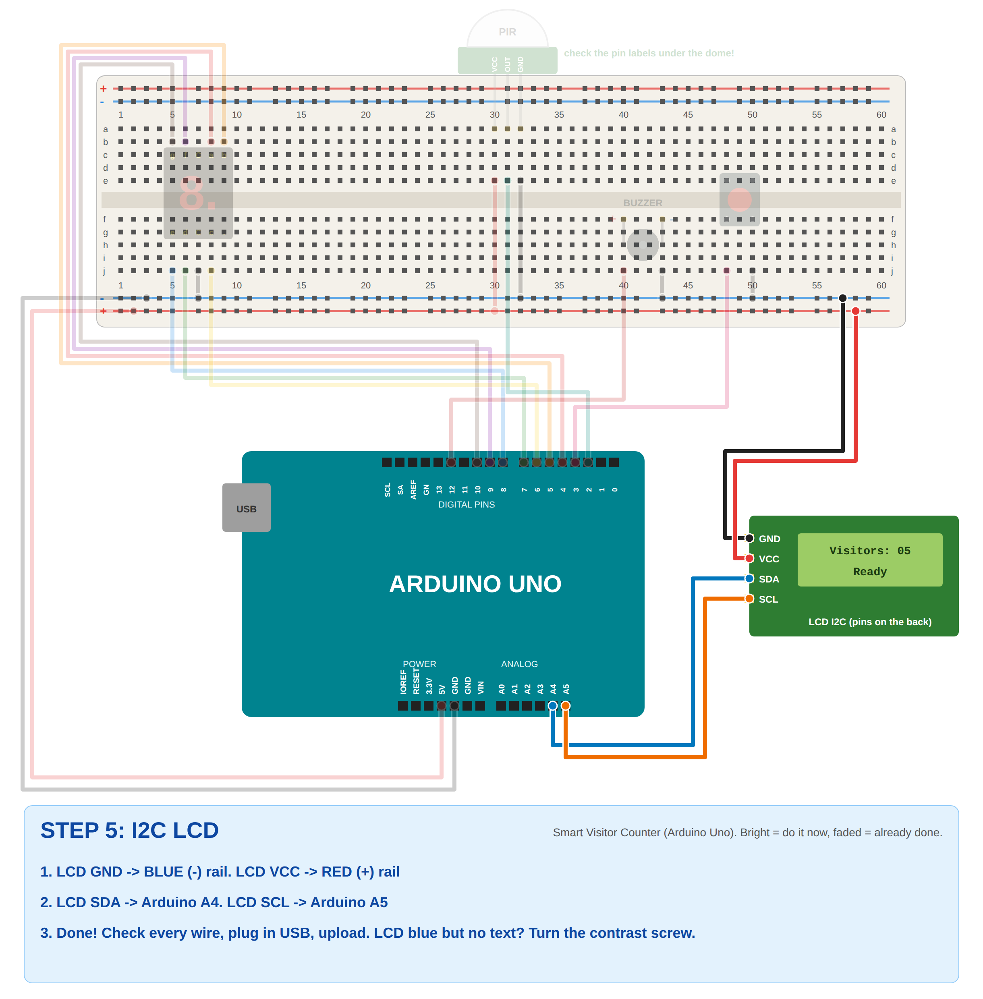
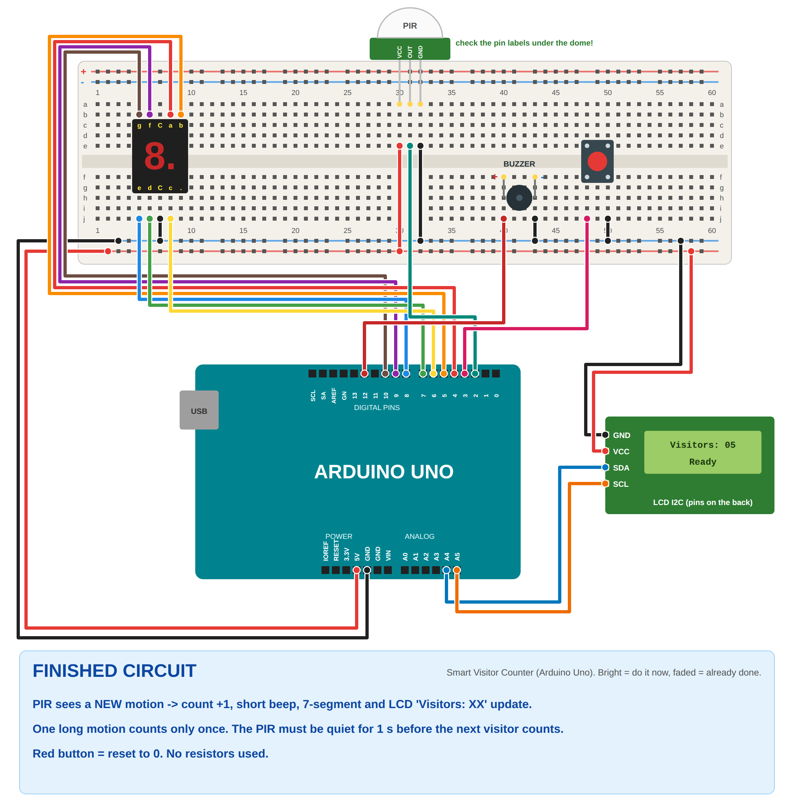

# Problem 10: Smart Visitor Counter (Arduino Uno)

✅ **Verified:** compiles for **Arduino Uno** (27% flash, 33% RAM, no warnings). The logic passes **21 simulated tests**
(`sim_test/run.sh`): warm-up ignored, one count + one beep per visitor, one long or flickering motion counts only once,
counts past 9, reset button (with contact bounce), and only one 7-segment segment is ever on at a time.

## What it does
| Event | Result |
|-------|--------|
| PIR sees a **new** motion | Count **+1**, **short beep**, 7-segment shows the count, LCD line 1 `Visitors: 05`, line 2 `Visitor detected` |
| Person keeps moving in front of the PIR | **No extra counts.** One continuous motion = one visitor. |
| PIR quiet for 1 s, then new motion | Next visitor counted |
| Press the **button** | Counter reset to **0** (LCD `Counter reset`) |
| First 15 s after power-on | LCD `PIR warm-up 15s...`; the PIR is ignored while it settles |

How each requirement is met:
- **PIR detects a visitor:** PIR OUT → D2. HIGH = motion.
- **Each valid detection +1:** counts only on the **start** of a motion (LOW → HIGH) **and** only if the PIR was quiet ≥ `REARM_MS` (1 s) before.
- **Count on the 7-segment:** shows 0–9 (the last digit when over 9).
- **"Visitors: XX" on the LCD:** line 1 `Visitors: 05` (two digits).
- **Short beep per visitor:** `tone(BUZZER, 2000, 150)`.
- **Button resets to zero:** D3 with `INPUT_PULLUP`, debounced.
- **One continuous motion ≠ many counts:** after counting, `armed = false` until the PIR stays LOW for 1 s.

## Components (no resistors)
- Arduino Uno + USB cable
- PIR motion sensor (HC-SR501)
- 1-digit 7-segment display (common cathode)
- I2C LCD 16x2
- Buzzer
- Push button
- Breadboard and jumper wires

**No resistors?** The code lights the 7-segment **one segment at a time** (1 ms on, 1 ms off, very fast, so your eyes
see the whole digit). That keeps the current low. The digit looks a little dimmer, which is normal. If you get 220 Ω
resistors, put one in each segment wire and set `SEG_OFF_US = 0` for a brighter display.

## Wiring
| Part | Pin | Arduino Uno |
|------|-----|-------------|
| Breadboard **red +** rail | | **5V** |
| Breadboard **blue −** rail | | **GND** |
| 7-seg **a** (8b) | | **D4** |
| 7-seg **b** (9b) | | **D5** |
| 7-seg **c** (8j) | | **D6** |
| 7-seg **d** (6j) | | **D7** |
| 7-seg **e** (5j) | | **D8** |
| 7-seg **f** (6b) | | **D9** |
| 7-seg **g** (5b) | | **D10** |
| 7-seg **COM** (7j) | | − rail (GND) |
| PIR | VCC / GND | + rail / − rail |
| PIR | OUT | **D2** |
| Button | one leg / diagonal leg | **D3** / − rail |
| Buzzer | + / − | **D12** / − rail |
| LCD | GND / VCC | − rail / + rail |
| LCD | SDA / SCL | **A4** / **A5** |

### 7-segment pins (front view, dot bottom-right)
```
 top row:     g   f  COM  a   b        -> columns 5 6 7 8 9, row c
 bottom row:  e   d  COM  c  DP        -> columns 5 6 7 8 9, row g
```
**Common anode instead?** (Dark display.) Move the COM wire from the blue − rail to the **red + rail** and set
`COMMON_ANODE = true`.

### PIR (HC-SR501) settings
- Lift the white dome: the pins are labeled **VCC, OUT, GND** (the order can differ between boards, so follow the labels).
- **Jumper on H** (repeat trigger), **TIME knob fully left** (shortest, about 3 s), SENS knob in the middle.
- It needs **15–60 s** after power-on to settle. The code waits 15 s (`WARMUP_MS`).

## Step-by-step breadboard pictures
Bright = do it now, faded = already done. Yellow tags = exact hole (`8b` = column 8, row b).

| Step | |
|------|---|
| 1. Power |  |
| 2. 7-segment |  |
| 3. PIR |  |
| 4. Buzzer + button |  |
| 5. LCD |  |
| Finished |  |

## Upload and test
1. **Tools → Board → Arduino AVR Boards → Arduino Uno**, **Port → COMx**.
2. Install **LiquidCrystal I2C** (Frank de Brabander) if you haven't yet.
3. Open `visitor_counter_uno.ino` → **Upload**.
4. LCD: `Visitors: 00` / `PIR warm-up 15s` → counts down → `Ready`. The 7-segment shows **0**.
5. Wave your hand in front of the PIR → **beep**, count 1. Keep waving → stays 1.
   Stand still / move away, wait a few seconds, then wave again → 2.
6. Press the button → back to **0**.
7. Serial Monitor (9600) prints `Visitor! Count = N`. The Uno's **L** LED is on while the PIR sees motion.

## Explaining the code
- `refreshDisplay()`: lights **one segment at a time** from the `DIGITS[]` table (bit 0 = a ... bit 6 = g), 1 ms each,
  with a 1 ms gap. This is fast enough that the whole digit looks steady, and the current stays low.
- **PIR logic:**
  ```
  if (pir && !lastPir && armed) { countVisitor(); armed = false; }   // new motion
  if (!pir && quiet for REARM_MS) armed = true;                      // ready for next visitor
  ```
- `buttonPressed()`: debounced (50 ms), true once per press → `resetCounter()`.
- LCD line 1 is always `Visitors: XX`. Line 2 shows a status (`Ready`, `Visitor detected`, `Counter reset`).

## Settings
| In the code | Default | Change if... |
|-------------|---------|--------------|
| `REARM_MS` | 1000 | Visitors walk past very quickly (smaller) or one person counts twice (bigger) |
| `WARMUP_MS` | 15000 | The PIR gives false counts right after power-on (bigger) |
| `COMMON_ANODE` | false | The 7-segment stays dark (true, and COM → 5V) |
| `lcd(0x27, ...)` | 0x27 | The LCD stays blue with no text (try `0x3F`, and turn the contrast screw) |

## Troubleshooting
| Problem | Fix |
|---------|-----|
| Counts by itself with nobody there | PIR still warming up, or SENS knob too high. Turn SENS down a little. Keep it away from fans and sunlight. |
| One person counts 2–3 times | Turn the PIR **TIME** knob fully left, set the jumper to **H**, or increase `REARM_MS` to 2000 |
| Never counts | OUT on D2? VCC on 5V? Wait for `Ready`. The L LED should light when you wave. |
| Wrong digit shapes | A segment wire in the wrong place (a=D4 ... g=D10). Check the pinout above. |
| 7-segment dark | COM not on the − rail, or the display is common anode (see above) |
| Button does nothing | Use **diagonal** legs: 48j → D3, 50j → GND. The button must cross the middle gap. |
| No beep | Buzzer + on D12, − on GND |
| LCD dark / blue only | Rails split in the middle (bridge them), contrast screw, address `0x3F`, SDA=A4, SCL=A5 |
